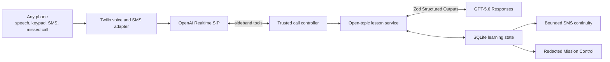

# Continuum

[](https://github.com/Tanya-Khanna/nomad-ai/actions/workflows/release-gate.yml)

> Continuum is a teacher you call on the phone. Any phone.

**If you can make a phone call, school is open.**

Continuum is a patient, multilingual teacher for someone who may have only a basic keypad phone. The learner calls, asks to learn anything, and is taught through speech, keypad input, and optional short SMS messages. There is no app, smartphone, camera, internet connection, email address, course catalog, or reading requirement.

After language and identity, every new learner hears one open question:

> “What would you like to learn?”

Continuum listens for the learner’s current understanding, diagnoses what is blocking them, chooses a teaching method, teaches one small step, and checks whether the idea transfers. If an explanation does not help, it changes methods. It remembers only learning state that is useful and permitted. If the line drops, the exact pending question survives.

Continuum extends teachers and schools. It does not claim to replace them.

## What makes it Continuum

1. **It teaches; it does not merely answer.** It asks useful questions, explains missing prerequisites, uses examples and worked steps, and checks teach-back and transfer instead of dumping an answer.
2. **It reaches an ordinary phone.** Calls, DTMF, and tiny SMS messages form the full learner experience.
3. **It teaches in the learner’s language.** Language is chosen first. The structured teaching path accepts BCP-47-style language tags and natural code-switching.
4. **It is a continuing learning relationship.** A private six-digit learner code supports shared phones, cross-phone identity, selective memory, and exact drop recovery.
5. **It is safe for a child to use alone.** It is a bounded teacher—not a friend, parent, therapist, romantic companion, or substitute for human support.

## Current runnable product

The current production call path implements:

- Language-first speech and 1–9 keypad routing, plus `*` for an explicitly named unlisted language.
- Separate verified turns for learner name and existing learner-code status.
- One open-topic experience with no subject, grade, mode, curriculum, or duration menu.
- OpenAI Responses with Zod Structured Outputs for `LearningIntent`, `TopicPlan`, diagnosis, teaching method, voice-native activity, evidence, uncertainty, and human-support decisions.
- A trusted application state machine for phases, one-question voice rules, meaningful method switches, understanding evidence, and mastery caps.
- Speech-first learning with `0` repeat, `9` hint, `*` keypad fallback, 1–4 choices, and 1/2 teaching feedback.
- Atomic persistence before speech, pause-on-drop, same-phone resume, and portable cross-phone resume.
- PII redaction, consented preference memory, memory inspection, correction, and two-step deletion.
- One-question SMS practice and phone-bound replies, progress/memory/stop/delete controls, MessageSid idempotency, and bounded handling of unsupported SMS chat.
- One-time exam/revision SMS reminders with exact-phone authorization, a separate spoken/keypad consent turn, quiet hours, one-segment formatting, due-job locking, and immediate `STOP` cancellation.
- A missed-call callback adapter, carrier receipt ledger, cost/usage metrics, and an access-controlled redacted proof view.
- A zero-credit open-topic CLI and a 39-case deterministic anti-wrapper gate.

The public phone number remains gated until the final real-carrier acceptance matrix passes. Automated success is not presented as live-carrier proof.

## Why this is not a GPT wrapper

A thin wrapper would add “act as a teacher” to a transcript, speak the answer, and forget the call. Continuum’s product behavior lives in application-owned systems around the models:

| Concern | GPT proposes | Trusted Continuum code owns |
|---|---|---|
| Teaching | Intent, diagnosis, method, activity, assessment | Allowed phase transitions, one-question policy, failed-method rule |
| Learning proof | Semantic interpretation of an open response | Evidence ledger, independence rules, DTMF cap, understanding state |
| Voice | Natural multilingual delivery | Call stages, verified transcripts, barge-in cancellation, DTMF routing |
| Continuity | Concise learner-facing wording | Atomic checkpoint, exact pending prompt, portable resume |
| Memory | Candidate preferences and relevant history | Consent, field allowlist, redaction, sibling isolation, deletion |
| SMS | Candidate recap or practice text | Recipient binding, signature validation, idempotency, bounded commands |
| Safety | Structured risk and uncertainty classification | Forced human-support boundary, blocked state changes, audit evidence |

The model cannot choose a subject from silence, create a learner from a name alone, turn a keypad guess into secure understanding, replace the trusted transcript with a forged tool argument, or bypass consent by asking for a state change in prose.

## Architecture



Realtime handles listening, speech, turn-taking, and SIP DTMF events. It does not invent teaching. Every substantive learner utterance is sent to the sideband controller, which uses the server-verified transcript and asks the structured teaching engine for the next activity. The application validates and persists that activity before it can be spoken.

The historical curriculum compiler, five reviewed starter packs, placement flow, Guided mode, Curious Sandbox, and outbound lesson-call scheduler remain in Git history and legacy regression fixtures. They are not loaded by the current learner call runtime.

## Teaching loop

The application advances through a trusted version of:

`LISTEN → CLARIFY → ELICIT PRIOR MODEL → DIAGNOSE → CHOOSE METHOD → TEACH → PRACTICE → FEEDBACK → TEACH-BACK → TRANSFER → REFLECT → SAVE`

The structured engine can render explanations, Socratic prompts, analogies, stories, worked examples, hints, quizzes, retrieval, teach-back, transfer, reflection, and recap. Every spoken activity is limited to three short sentences and one question, with no Markdown, URLs, tables, or symbolic fraction notation.

Secure understanding requires independent, conceptually valid transfer or later retention. A correct guess, guided response, or keypad-only answer cannot become secure.

## Phone and keypad experience

The live SIP flow uses OpenAI Realtime with a server-side sideband WebSocket. The server accepts the signed incoming-call event, attaches to the exact call, sends the language prompt, and dynamically exposes only tools valid for the current stage.

DTMF is stage-aware:

- Language: configured digit; `*` to say another language.
- Identity: six learner-code digits followed by `#`.
- Lesson: `0` repeats the exact prompt, `9` requests a hint, and `*` asks for keypad fallback.
- Choice: 1–4 works only when those exact choices were spoken for the current activity.
- Feedback: 1 means helpful and 2 means not helpful only while that question is active.

Unrelated digits, blank transcription, unclear audio, duplicate tool calls, and stale stage actions do not advance learning state. When DTMF interrupts audio, the controller cancels the active response and clears unplayed audio before routing the key.

The implementation follows OpenAI’s official [Realtime SIP sideband-control guidance](https://developers.openai.com/api/docs/guides/realtime-server-controls) and [Realtime server-event contract](https://developers.openai.com/api/reference/resources/realtime/server-events).

## SMS is continuity, not a second chatbot

SMS can carry one small thread across calls:

- A pause reminder after a dropped lesson.
- One short practice question with a bound reply code.
- A progress or selective-memory summary for an authorized number.
- One consented exam/revision reminder, requested during a call and confirmed in a separate speech or keypad turn.
- Stop and two-step deletion controls.

An arbitrary text such as “teach me a whole lesson here” receives bounded help text; it is never forwarded into an open GPT conversation. Practice replies are bound to the assignment, learner, and receiving phone, and multiple-choice evidence cannot create secure understanding.

Recurring outbound tutoring calls have been removed from the current product. One-time reminder delivery remains disabled by default and requires guardian SMS enrollment plus `NOMAD_SMS_REMINDERS_ENABLED=true`; the learner must still confirm each reminder separately.

## Memory and privacy

> Continuum remembers what helps you learn and forgets what it does not need.

The application may keep the learner’s preferred name and language, current topic and objective, supported obstacle or misconception, helpful and failed methods, evidence state, exact next question, and explicitly approved learning preferences.

It does not retain raw call recordings by default, background conversations, precise location, unnecessary personal stories, or inferred caste, religion, economic, family, or psychological profiles. Likely phone numbers, email addresses, URLs, and street-address disclosures are redacted before model input and persistence. The proof API uses an anonymized learner reference and excludes names, phone numbers, and phone hashes.

This is a supervised prototype, not an approved child deployment. See [docs/SAFETY_PRIVACY.md](docs/SAFETY_PRIVACY.md) for the pre-pilot work still required.

## Run locally without API credit

Requirements: Node.js 22 or newer.

```bash
npm install
npm run chat -- --name Ravi --phone +919999900001 --language en
```

The first prompt is `What would you like to learn?` Try unrelated topics in the same runtime:

- `Help me understand a verb.`
- `Why does the moon seem to follow our car?`
- `Teach me how to prepare for a chemistry exam.`

Type `exit` to simulate a dropped call. Run the same command again to resume the exact saved question.

The offline adapter exercises the open-topic state machine and persistence without pretending to know arbitrary facts. Set `TEACHING_ENGINE=openai` and configure an API key for actual open-world teaching.

## Verify

```bash
npm run check
npm run eval
npm run build
```

- `npm run check` runs strict TypeScript and all deterministic unit/integration tests.
- `npm run eval` runs 39 zero-credit v7 gates covering the product contract, trusted model boundary, diagnosis evidence, phase/evidence rules, voice output, method switching, teach-back, transfer, mastery honesty, safety, privacy, memory, exact continuity, and unrelated topics through one pack-free engine.
- `npm run build` compiles the production server.

The current GPT-powered evaluation is opt-in because it spends API credit. It
runs nine v7 cases through the same Responses engine used by the phone teacher
and writes a revision-bound report for Mission Control and release preflight:

```bash
npm run eval:live -- --confirm-spend
# or one targeted case
npm run eval:live -- --confirm-spend --case hinglish-code-switch
```

For an independent clean export/install/build/test run:

```bash
npm run verify:fresh
```

Historical curriculum-specific eval commands remain under `eval:legacy:*` for
audit, but their results are not the current v7 release gate.

For the complete operator sequence—from clean installation through every
automated, model, browser, carrier, DTMF, SMS, privacy, safety, continuity, and
submission check—follow [docs/TESTING_GUIDE.md](docs/TESTING_GUIDE.md).

## Server and Mission Control

```bash
npm run dev
```

- Landing page: `http://localhost:3000/`
- Health: `http://localhost:3000/health`
- Internal proof: `http://localhost:3000/dashboard`

Mission Control is observability for builders and judges, not a learner classroom. An open-topic session shows an anonymized transcript, activity, diagnosis, redacted reasoning evidence, strategy change, evidence kind/result, understanding state, knowledge boundary, human-support decision, model route, latency, and cost estimate.

When deployed publicly, dashboard learner data requires `NOMAD_DASHBOARD_TOKEN`. A URL fragment can place the token into tab-scoped session storage without sending it in the page request; the API receives it only in an Authorization header.

## Configuration

Copy `.env.example` to `.env`. Never commit credentials.

Key settings:

```dotenv
TEACHING_ENGINE=offline
NOMAD_DATABASE_PATH=.data/nomad.db
OPENAI_TEXT_MODEL=gpt-5.6-luna
OPENAI_REALTIME_MODEL=gpt-realtime-2.1-mini
OPENAI_REALTIME_VOICE=marin
NOMAD_SMS_REMINDERS_ENABLED=false
```

Live teaching additionally needs `OPENAI_API_KEY`. Phone calls require the OpenAI webhook/SIP project settings and Twilio credentials documented in [docs/PHONE_SETUP.md](docs/PHONE_SETUP.md). Run the secret-safe checks before spending on a call:

```bash
npm run secrets:init
npm run phone:preflight
```

For a child-safety test, authorize the exact SMS number before requesting a reminder on a call:

```bash
npm run guardian:enroll -- --learner-code 123456 --guardian-phone +919999999999
```

The command returns a private guardian code used by bounded SMS controls such as `STOP <code>`. It does not pre-consent to a reminder; the learner must still confirm the proposed topic and time during the call.

The missed-call path uses a signed Twilio webhook and returns first-verb `<Reject reason="busy">` before queuing the callback. This avoids answering that inbound Twilio leg; local-carrier charging behavior remains deployment-specific. See Twilio’s official [`<Reject>` documentation](https://www.twilio.com/docs/voice/twiml/reject).

## OpenAI model use

- **GPT-5.6 Luna through the Responses API:** structured learning intent, topic plan, diagnosis, method choice, open-response assessment, uncertainty, and the next voice-native activity.
- **Realtime SIP:** multilingual audio, interruption handling, transcription, natural delivery, and DTMF events.
- **Structured Outputs:** Zod-backed model contracts; valid JSON is necessary but trusted code still owns educational and safety semantics. See OpenAI’s [Structured Outputs guide](https://developers.openai.com/api/docs/guides/structured-outputs).
- **Codex:** architecture migration, implementation, tests, debugging, documentation, and the dated decision log in [CODEX_NOTES.md](CODEX_NOTES.md).

The current model names are deployment defaults, not a claim that every task needs the largest model. No hidden chain-of-thought is requested or stored.

## Honest limitations and open release gates

- The new open-topic path is automated-test green but still needs the complete real-carrier journey after deployment.
- Public language claims must be limited to adult-speaker carrier patterns actually tested; keypad routing alone does not prove speech quality.
- The zero-credit adapter validates state and pedagogy boundaries but cannot teach arbitrary facts without a model.
- One-time reminder automation is implemented and deterministic-test green, but real Twilio delivery and multilingual natural-date interpretation still require carrier acceptance on the deployed revision.
- The revision-bound nine-case live GPT v7 suite is implemented; it must be run
  with explicit spend confirmation on the final commit before release.
- The final demo, `/feedback` session ID, Devpost acceptance, public repository/judge access, and human-written submission description remain human release steps.
- Voice-only access excludes deaf and hard-of-hearing learners; SMS is supplementary, not an equivalent classroom.

The current authority and struck-through progress ledger are in [docs/BUILD_PLAN.md](docs/BUILD_PLAN.md). Final carrier and submission steps live in [docs/FINAL_ACCEPTANCE_RUNBOOK.md](docs/FINAL_ACCEPTANCE_RUNBOOK.md).

## Repository history and naming

The project was renamed from its working title. Existing `NOMAD_` environment names, the `nomad-ai` GitHub slug, and old database columns remain compatibility identifiers; learner-facing copy and current architecture use **Continuum**.

The historical curriculum compiler and frozen packs are retained because deleting reviewed work would weaken auditability. They do not define the product and cannot enter the live open-topic runtime without an explicit future decision.

## License

MIT License. Copyright 2026 Tanya Khanna.
