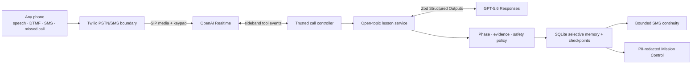

# Continuum

[](https://github.com/Tanya-Khanna/continuum-voice-tutor/actions/workflows/release-gate.yml)

> **The connection may drop. The learning continues.**

**Continuum is a patient teacher you call on any phone.** A learner can ask to understand any safe topic in their language and be taught through an ordinary voice call, keypad input, and optional short SMS—without a smartphone, app, camera, email account, or mobile data.

Try the [hosted release candidate](https://continuum-production-8971.up.railway.app/) or run the complete teaching controller locally for free. The hosted revision is reported by [`/health`](https://continuum-production-8971.up.railway.app/health) and must match the final repository revision before judging.

## The problem

Most learning software assumes a private smartphone, a readable visual interface, affordable data, and stable internet. Continuum is designed for a different constraint: a learner may have brief access to a shared basic phone, an unreliable line, limited literacy, and no usable data connection.

The product therefore starts with a spoken language choice, asks one question at a time, accepts keypad input when speech fails, separates siblings on a shared number, saves an exact checkpoint before speaking, and uses tiny authorized SMS messages for continuity. The learner experience is the call—not a reduced version of a web app.

Continuum extends teachers and schools into hours, places, languages, and devices they may not reach. It does not claim to replace them, operate an emergency service, or prove real-world learning outcomes from synthetic tests.

## One complete learner journey

1. **Reach it.** A learner calls directly or places a missed call. In a configured sponsored deployment, Twilio rejects the inbound leg before answer and Continuum calls back within rate limits and quiet hours.
2. **Choose a language first.** The spoken menu offers nine configured keypad choices. `*` lets the learner name another language; location, accent, silence, and a learner's name never select one.
3. **Identify privately.** A new learner gives a chosen name and receives a random six-digit portable code. A returning learner enters six digits plus `#`. One phone can hold separate sibling profiles, and the code can recover the same profile from another phone.
4. **Ask anything safe.** Continuum asks, “What would you like to learn?” There is no subject menu, syllabus, placement quiz, or hidden curriculum dependency.
5. **Be taught.** GPT-5.6 proposes a structured learning intent, topic plan, diagnosis, teaching method, voice activity, evidence interpretation, and safety decision. Trusted code checks the proposal, stores the pending question, and only then lets Realtime speak it.
6. **Participate.** The teacher elicits the learner's current model, explains a prerequisite when needed, changes method after unhelpful feedback, and moves through practice, teach-back, transfer, reflection, and recap. A correct guess is not treated as understanding.
7. **Recover.** `0` repeats, `9` asks for a hint, and `*` requests keypad choices. Unclear audio repeats the current prompt without advancing state. If the call drops, the session pauses; a consented SMS can say that the lesson is waiting. The next call resumes the exact persisted question—even from another phone.
8. **Continue safely.** Authorized SMS can carry one practice question, a recap, a pause notice, a one-time exam/revision reminder, progress or selective-memory controls, `STOP`, and two-step deletion. SMS never becomes an unrestricted chatbot.

A substantive lesson ends with the learner's own reflection and a useful next retrieval question. Completion means the learner had an opportunity to explain or transfer an idea—not that a model merely produced an answer.

## Why this is not GPT behind a phone number

A voice wrapper transcribes a question, adds “act as a tutor,” speaks the answer, and forgets the session. Continuum gives probabilistic models a narrow proposal role inside an application-owned teaching system.

| Concern | GPT-5.6 or Realtime proposes/handles | Trusted Continuum code owns |
|---|---|---|
| Pedagogy | Learning intent, tentative diagnosis, method, activity, open-response interpretation | Stage order, evidence requirements, method-switch rule, one-question voice contract |
| Understanding | Semantic interpretation of a response | Evidence ledger, independence rules, DTMF cap, secure-understanding policy |
| Voice | Speech, transcription, barge-in, natural multilingual delivery | Call admission, stage-gated tools, verified transcript, stale-event rejection, DTMF routing |
| Continuity | Concise learner-facing wording | Atomic checkpoint before speech, exact prompt, pause state, portable resume |
| Memory | Candidate learning preferences and relevant history | Consent, field allowlist, PII redaction, sibling isolation, correction, deletion |
| SMS | Candidate recap, practice, or reminder wording | Signature validation, exact-phone authorization, idempotency, one-segment limits, `STOP` |
| Safety | Structured uncertainty and risk classification | Forced human-support boundary, prohibited state changes, auditable policy failures |

The model cannot create a learner from silence, select a topic the learner did not say, replace the server transcript with a forged tool argument, make a keypad guess “secure,” repeat a failed method silently, send an unconsented reminder, or skip a trusted teaching phase by returning different JSON.

## Architecture



### Responsibilities by component

- **Twilio** connects ordinary phone calls to the OpenAI SIP endpoint, receives missed-call and carrier-status webhooks, sends/receives SMS, and reports carrier duration and cost. Every state-changing Twilio webhook is signature-validated and idempotent.
- **OpenAI Realtime over SIP** handles live audio, transcription, interruption, turn-taking, voice output, and DTMF events. It receives only the tools allowed at the current application-owned call stage.
- **GPT-5.6 through the Responses API** performs the difficult pedagogical reasoning: preserving intent, separating hypotheses from supported misconceptions, choosing a method, assessing an open response, planning a voice-native activity, expressing uncertainty, and proposing a human-support decision.
- **Structured Outputs and Zod** constrain every model-facing request and response. Schema validity is necessary but not sufficient; trusted semantic policy runs after validation and allows one bounded model correction before failing closed.
- **The sideband controller** uses server-verified transcription, not untrusted function arguments, and controls language, identity, teaching, feedback, reminder consent, DTMF, cancellations, duplicate/stale events, and exact response playback.
- **The lesson state machine** owns the phase transition, evidence type, method-switch invariant, voice rules, mastery cap, safety boundary, and next checkpoint.
- **SQLite** stores keyed phone hashes, separate learner identities, selective educational memory, exact pending prompts, evidence, authorization, idempotency receipts, callback/reminder jobs, and carrier usage. Tables and forward-compatible migrations initialize automatically at startup; no manual migration command is required.
- **Mission Control** is a protected builder/judge proof surface—not a learner dashboard. It exposes anonymized teaching traces, deterministic/live evaluation reports, readiness, and labeled access/reliability/learning metrics without names, raw phone numbers, phone hashes, secrets, or hidden chain-of-thought.

## Teaching system

The application advances through a trusted version of:

`LISTEN → CLARIFY → ELICIT PRIOR MODEL → DIAGNOSE → CHOOSE METHOD → TEACH → PRACTICE → FEEDBACK → TEACH-BACK → TRANSFER → REFLECT → SAVE`

Activities include Socratic prompts, concise explanations, analogies, stories, worked examples after an attempt, hint ladders, retrieval, quizzes, teach-back, novel transfer, reflection, and recap. Every spoken activity is limited to three short sentences and one question, with no Markdown, links, tables, or unexplained symbolic fraction notation.

The first request supplies intent, not evidence of a misconception. A diagnosis must name its evidence basis. When the learner says an explanation did not help, the next method must be genuinely different. Secure understanding requires independent conceptual transfer or later retention with reasoning; guided, guessed, or DTMF-only success is capped below secure.

For current, disputed, unverifiable, high-stakes, or unsafe topics, Continuum expresses uncertainty or stops ordinary teaching and directs the learner toward an appropriate trusted or qualified human. Academic struggle alone never silently contacts another person.

## Keypad and low-connectivity behavior

DTMF travels over the same SIP call and enters the same trusted controller as speech:

- Language: configured `1`–`9`; `*` names an unlisted language.
- Identity: six digits followed by `#`.
- Active lesson: `0` repeats the exact prompt, `9` requests a hint, `*` requests keypad fallback.
- Reviewed choice: `1`–`4` only when the current activity spoke those choices.
- Teaching feedback: `1` helpful, `2` not helpful only while that question is pending.

When a key interrupts speech, the controller cancels the active Realtime response, clears unplayed audio, and rejects late tool calls associated with the cancelled response. Blank transcription, unrelated digits, duplicate provider events, stale tool calls, and malformed output do not advance learning.

Before a question is spoken, its activity ID, phase, exact prompt, evidence, strategy, and resume state are committed. A dropped call therefore recovers stored state rather than asking a model to reconstruct what probably happened.

## SMS is a bounded continuity channel

Supported SMS behavior is deliberately small:

- Lesson recap and one practice question with an assignment code.
- Authorized homework reply bound to that assignment, learner, and phone.
- Pause notice after a dropped call.
- Separately requested and confirmed one-time exam/revision or call-back reminder.
- Guardian-authorized progress and selective-memory summaries.
- `STOP <guardian-code>` and two-step profile deletion.

Twilio signatures, `MessageSid` idempotency, recipient hashes, one-segment formatting, quiet hours, due-job locking, and immediate `STOP` cancellation are enforced in application code. An arbitrary “teach me over text” message receives bounded help and is never forwarded into an open model conversation. Recurring outbound lesson calls are not part of the submitted product.

## How we used Codex and GPT-5.6

### Codex

Codex was used throughout the July 16–21 build—not only to scaffold code. Its concrete contributions include:

- Designing and implementing the Realtime SIP sideband boundary, trusted teaching state machine, Zod schemas, SQLite persistence, DTMF routing, callback/SMS adapters, Mission Control, and deterministic/live evaluations.
- Refactoring the product from a curriculum menu into one open-topic teacher while preserving working telephony, identity, persistence, recovery, and safety infrastructure.
- Debugging live-call behavior, adding regression tests, reviewing security/privacy boundaries, verifying deployment health, and preparing clean-clone release automation and public documentation.

One concrete debugging example: a real call replayed part of the language menu and selected Science after the learner had said nothing. It also treated a spoken name as proof that no existing learner code was available. With Codex, the event trace was followed through Realtime audio and delayed tool calls. The fix cancelled active speech, cleared unplayed audio, rejected stale response IDs, and split identity into two trusted turns. Regression tests now prove that silence cannot select language/topic or create identity, and that DTMF interruption cannot be overwritten by a late model event.

### GPT-5.6

GPT-5.6 is not used because telephony needs a large model. It is used where teaching needs semantic judgment across arbitrary subjects and languages: understanding what the learner is trying to learn, distinguishing missing evidence from a supported misconception, selecting and changing pedagogy, evaluating free-form reasoning, generating an age-appropriate voice activity, and deciding when uncertainty or human support is necessary.

The model returns a versioned structured decision. Trusted code may correct deterministic fields, reject policy violations, retry once with explicit failures, or fail closed. OpenAI requests use `store: false`, a one-way safety identifier, and no hidden chain-of-thought request.

### Product decisions owned by the builder

The builder chose to remove the subject/grade menus and curriculum-pack runtime so the product stayed “a teacher you call,” not an LMS. Other deliberate choices were to keep SMS bounded rather than create a second chatbot, cap keypad evidence below secure, remove recurring outbound calls in favor of user-controlled access and one-time reminders, store selective learning memory rather than raw recordings, and keep the public phone number hidden until the deployed carrier matrix passes.

Repository history begins on July 16, 2026 with the license and zero-credit teaching foundation; the application was created and iterated during Build Week. The dated commit history shows the progression from offline pedagogy through Realtime, telephony, persistence, safety, evaluation, deployment, and the final open-topic product.

## Run locally for free

### Requirements

- Node.js 22 (see `.nvmrc`)
- npm 10.9.3 or a compatible npm 10 release
- macOS, Linux, or Windows with a Node-compatible `better-sqlite3` build

Install exactly from the lockfile:

```bash
git clone https://github.com/Tanya-Khanna/continuum-voice-tutor.git
cd continuum-voice-tutor
nvm use
npm ci
cp .env.example .env
```

No database command is needed. The first process creates `.data/nomad.db` and applies application-owned schema migrations.

Start the deterministic offline teacher:

```bash
npm run chat -- --name Ravi --phone +910000000042 --language en
```

Expected first output includes:

```text
What would you like to learn?
```

Try `Why do shadows change length?` The offline engine demonstrates the state transition without pretending to know arbitrary facts. Type `exit` after one teaching turn, then run the same command again. Expected behavior:

- `Session: resumed`
- The exact previously pending question is printed.
- The completed turn count does not increase merely because the process restarted.

Use synthetic adult names and reserved example numbers only. The CLI hashes the phone value, but a real number is unnecessary.

## Configuration

`.env.example` is the complete non-secret template. Important groups are:

| Purpose | Variables |
|---|---|
| Local/runtime | `TEACHING_ENGINE`, `HOST`, `PORT`, `NOMAD_DATABASE_PATH` |
| Application secrets | `NOMAD_PHONE_HASH_SECRET`, `NOMAD_LEARNER_CODE_SECRET`, `NOMAD_GUARDIAN_CODE_SECRET`, `NOMAD_CALLBACK_SECRET`, `NOMAD_DASHBOARD_TOKEN` |
| OpenAI | `OPENAI_API_KEY`, `OPENAI_TEXT_MODEL`, `OPENAI_REALTIME_MODEL`, `OPENAI_REALTIME_VOICE`, `OPENAI_WEBHOOK_SECRET`, `OPENAI_PROJECT_ID` |
| Twilio | `TWILIO_ACCOUNT_SID`, `TWILIO_AUTH_TOKEN`, `TWILIO_PHONE_NUMBER`, optional `TWILIO_MISSED_CALL_NUMBER` |
| Access/safety | callback allowlist, quiet hours, daily limits, call-rate limit, explicit SMS/callback/publication flags |
| Release evidence | `NOMAD_PUBLIC_BASE_URL`, `NOMAD_RELEASE_COMMIT`, live-eval report path |

Generate strong local application secrets with `npm run secrets:init`. Do not commit `.env`, databases, logs, recordings, transcripts, completed release receipts, or provider credentials.

Actual open-world text teaching requires `TEACHING_ENGINE=openai` and `OPENAI_API_KEY`. Phone service additionally requires an OpenAI project with a Realtime SIP webhook and a Twilio voice/SIP setup. Follow [docs/PHONE_SETUP.md](docs/PHONE_SETUP.md) and run `npm run phone:preflight` before making a paid call.

## Verification

### Free and deterministic

```bash
npm run verify
```

This runs formatting hygiene, strict unused-code linting, TypeScript, all deterministic unit/integration tests, the 39-case anti-wrapper pedagogy/safety evaluation, a production build, and a compiled-server smoke test. It does not call OpenAI or Twilio.

Current verified local results:

- **29 test files, 124 automated tests: pass**
- **39 deterministic teaching/safety/privacy cases: pass**
- **TypeScript, unused-code lint, production build, and production smoke: pass**

For an independent exported-tree install and exact resume proof:

```bash
npm run verify:fresh
```

That command copies only the proposed public files into a temporary directory, runs `npm ci`, production smoke, tests, deterministic evaluation, and a process-boundary exact-resume scenario. It ignores local `.env`, `.data`, dependencies, and internal ignored files.

### Paid or external

The nine-case GPT-5.6 suite uses the same Responses engine as live teaching and requires explicit spend confirmation:

```bash
npm run eval:live -- --confirm-spend
# targeted example
npm run eval:live -- --confirm-spend --case hinglish-code-switch
```

Its report is schema-validated and revision-bound. A report from an earlier commit is not accepted as current release evidence.

Carrier acceptance requires OpenAI and Twilio credentials and incurs provider cost. It covers inbound speech, DTMF, missed-call callback, signed SMS, same/cross-phone resume, interruption, call status, and usage receipts. Browser, paid-model, and carrier evidence are deliberately reported separately from deterministic tests. The complete sequence and expected results are in [docs/TESTING_GUIDE.md](docs/TESTING_GUIDE.md).

## Server, deployment, and judge proof

```bash
npm run dev
```

- Landing page: `http://localhost:3000/`
- Health/revision: `http://localhost:3000/health`
- Protected Mission Control shell: `http://localhost:3000/dashboard`

Mission Control APIs require `NOMAD_DASHBOARD_TOKEN`. The supported URL fragment places the token in tab-scoped session storage and removes it from the address without sending it in the request URL; APIs receive it only through `Authorization: Bearer`.

The production artifact is a compiled Node server and an unprivileged Docker image. SQLite needs one persistent volume and one application replica. See [docs/DEPLOYMENT.md](docs/DEPLOYMENT.md).

To keep judge access available through August 5, 2026 at 5:00 PM PT, the operator must keep Railway, the persistent volume, OpenAI billing, Twilio number/SIP configuration, and SMS/voice geographic permissions active; keep secrets unexpired; monitor `/health`; preserve a small provider budget; and avoid deploying a revision that has not passed `verify:fresh`, the paid live suite, and carrier smoke.

## Privacy, consent, and child-safety boundary

> **Continuum remembers what helps you learn and forgets what it does not need.**

The application stores a keyed hash of the caller number, a chosen name, language, topic, supported learning obstacle, methods and feedback, evidence state, exact pending question, authorization, and explicitly approved learning preferences. Six-digit learner and guardian codes are one-way protected; callback destinations are encrypted only while needed. Likely email, URL, phone, and street-address disclosures are redacted before model input and persistence.

Continuum does not store raw call audio by default, request a legal name, infer sensitive family/caste/religious/economic/psychological profiles, browse the web during a lesson, or expose learner identity in Mission Control. Shared-phone SMS and lock-screen previews remain disclosure risks. `STOP` cancels pending proactive messages; profile deletion requires confirmation.

This is a supervised prototype—not an approved child deployment. A real pilot needs local legal and safeguarding review, guardian consent and learner assent, native-speaker testing, retention and provider-deletion policies, role-based access, incident response, qualified human-support protocols, cost/access sponsorship, and evidence from real educational evaluation. Read [docs/SAFETY_PRIVACY.md](docs/SAFETY_PRIVACY.md) before enabling public access.

## Honest limitations

- The deterministic offline engine verifies orchestration and policy but does not provide arbitrary factual teaching.
- “Any language” is an architectural goal, not a claim of carrier-quality speech testing in every language. Public claims must name only the adult-speaker patterns tested on the final deployed revision.
- Speech recognition, accents, background noise, carrier codecs, and DTMF behavior vary by country and provider; keypad fallback reduces but does not eliminate exclusion.
- Voice-only teaching is not accessible to deaf or hard-of-hearing learners. SMS is supplementary, not an equivalent classroom.
- Pattern-based PII redaction is defense in depth, not a guarantee. The current prototype has no time-based automatic deletion policy.
- Current/disputed and high-stakes questions use uncertainty and human-support boundaries; Continuum does not browse for live answers or operate a real escalation network.
- Missed-call callback can shift call cost to a sponsor, but carrier treatment and toll-free availability are deployment-specific. Calls are not universally free.
- The public phone number remains gated until the complete final-revision carrier matrix passes. The hosted landing page alone is not proof that carrier access is ready.
- No pilot, partnership, user-research result, accessibility certification, or measured learning outcome is claimed.

## Repository map

```text
src/domain/          Zod contracts, evidence, identity, safety, usage
src/engine/          Offline and GPT-5.6 open-topic reasoning adapters
src/lesson/          Trusted teaching state machine and persistence boundary
src/telephony/       SIP, Realtime sideband, DTMF, callback, admission
src/messaging/       Bounded SMS practice, recap, reminders
src/persistence/     SQLite schema, migration, idempotency, deletion
src/observability/   Redacted Mission Control and product metrics
src/evals/           Deterministic and spend-gated live model evaluations
test/                Unit and integration boundary tests
scripts/             Release, clean-export, smoke, and asset tooling
docs/                Public setup, testing, deployment, and safety guides
```

## License, acknowledgments, and support

Continuum is licensed under the [MIT License](LICENSE). Dependency licenses, trademark notes, and synthetic-audio provenance are documented in [THIRD_PARTY_NOTICES.md](THIRD_PARTY_NOTICES.md).

OpenAI provides the Responses and Realtime APIs; Twilio provides PSTN/SIP and SMS transport; SQLite provides local persistence; Railway hosts the current release candidate. These are technical dependencies, not claimed partnerships.

For reproducible bugs or feature proposals, open a GitHub issue without secrets or learner data. Report vulnerabilities privately as described in [SECURITY.md](SECURITY.md). Contributions should follow [CONTRIBUTING.md](CONTRIBUTING.md).
