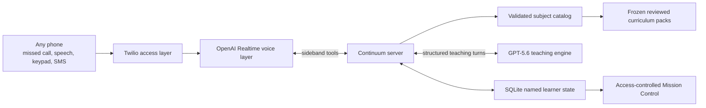

# Continuum

[](https://github.com/Tanya-Khanna/nomad-ai/actions/workflows/release-gate.yml)

> The connection may drop. The learning continues.

**Any phone. Any language. A tutor who comes back tomorrow.**

Continuum is a persistent, multilingual tutor for a learner who may have only a shared keypad phone. The classroom is an ordinary call, keypad input, and tiny SMS—not an app, camera, smartphone, email account, or mobile-data connection. OpenAI Realtime SIP handles the voice conversation; a server-side GPT-5.6 teaching engine diagnoses the misconception and chooses the next pedagogical move; trusted code validates, persists, and renders it against a frozen reviewed curriculum pack.

Continuum does not replace school or teachers. It extends high-quality tutoring to the hours, places, languages, and devices conventional digital education cannot reach.

The product was renamed from its working title on July 17. Existing `NOMAD_` environment variables, the `nomad-ai` repository slug, and persisted database paths remain compatibility identifiers for this build; learner-facing copy and the tutor identity use **Continuum**.



Realtime owns listening, speech, interruption, and tool choice. GPT-5.6 owns diagnosis and the next teaching move. Trusted application code validates the structured turn against the selected frozen pack before it can be spoken or persisted.

## What the runnable vertical slice proves

- A learner can request a sponsored callback through a signed, rejected missed call, or dial directly where normal call cost is acceptable.
- A six-digit portable learner code keeps siblings separate on one shared phone and restores the same learner from another phone.
- The tutor runs placement one question at a time, changes method after confusion, asks whether the explanation helped, and accepts that feedback by speech or `1/2`.
- Learning activities include explanations, analogies, stories, worked examples, hints, reviewed voice/DTMF quizzes, teach-back, transfer, reflection, retrieval, recap, and study-plan steps.
- Reviewed DTMF choices are curriculum data. Keypad participation is recorded honestly but cannot independently create secure mastery.
- The exact pending question is saved before it is spoken. A dropped call pauses the session; a return call resumes that question without replaying onboarding or completed work.
- Guardian-approved schedules can place recurring retrieval calls. `STOP` and `PAUSE` take effect before dialing, quiet hours are enforced, and a missed slot is not immediately redialed.
- Guardian SMS and voice/keypad controls expose progress, schedule, selective memory, pause/resume, and two-step deletion without revealing raw conversations or sibling data.
- Ask Anything is multi-turn and can save a learner-approved Curiosity Trail, but it cannot silently award curriculum mastery.
- Product metrics are divided into access, reliability, and learning; synthetic fixtures and live events are labeled separately.

The checked-in public guided menu contains only the human-reviewed Math pack. Science, English, History, and Geography stay hidden until their official-source briefs pass human approval, compilation, independent verification, builder spot-checking, and freeze.

See the [v6 build plan](docs/BUILD_PLAN.md), [32-story proof matrix](docs/USER_STORY_MATRIX.md), and [demo/judge runbook](docs/DEMO_AND_JUDGE_RUNBOOK.md) for the exact automated, carrier, curriculum-review, and submission gates.

## Why this access and teaching model

The access gap is large, but two commonly quoted populations are different and must not be added together. The ITU estimated **2.6 billion people were offline in 2024**, including 1.8 billion rural residents, while four in five people over age ten owned a mobile phone. GSMA separately estimated a **3.1 billion-person mobile-internet usage gap**: people covered by mobile broadband but not using it, with affordability and digital literacy among the main barriers. These are motivation for a voice channel, not proof that every offline learner has affordable calling access. ([ITU Facts and Figures 2024](https://www.itu.int/en/mediacentre/Pages/PR-2024-11-27-facts-and-figures.aspx), [GSMA State of Mobile Internet Connectivity 2024](https://www.gsma.com/newsroom/press-release/new-gsma-report-shows-mobile-internet-connectivity-continues-to-grow-globally-but-barriers-for-3-45-billion-unconnected-people-remain/))

UNESCO's 2024 global report projected a deficit of **44 million primary and secondary teachers by 2030**. Continuum is therefore framed as supervised learning support and teacher capacity—not a substitute for qualified teachers. ([UNESCO Global Report on Teachers](https://www.unesco.org/en/articles/global-report-teachers-addressing-teacher-shortages-and-transforming-profession))

The pedagogy is intentionally not “ChatGPT on a phone.” A field experiment with nearly 1,000 high-school math students found that unrestricted GPT-4 improved supported practice but produced a 17% reduction in grades after access was removed; a tutor design using teacher-authored hints largely mitigated the negative learning effect. That result motivates Continuum's refusal to dump answers, evidence-based diagnosis, hints, and independent checks. ([Bastani et al., *Generative AI Without Guardrails Can Harm Learning*](https://hamsabastani.github.io/education_llm.pdf))

Early low-bandwidth tutoring work is promising but still preliminary. A Ghana study of roughly 500 students reported a 0.36 effect size for the WhatsApp-based Rori math tutor—described as about an extra year of learning—at an estimated marginal cost near $5 per student, while explicitly cautioning that the result covered only year one. Adesua's six-month Ghana feasibility deployment reported 56 active users and 93.75% helpfulness, but that percentage came from only 16 ratings. Continuum treats both as evidence to run a real supervised pilot, not as outcomes it can inherit. ([Stanford SCALE / Rori study](https://scale.stanford.edu/publications/effective-and-scalable-math-support-experimental-evidence-impact-ai-math-tutor-ghana), [Adesua feasibility study](https://arxiv.org/abs/2605.15376))

Code-switching is likewise a teaching behavior rather than a locale toggle. SIGDIAL research describes educational code-switching as important but underexplored in LLM tutors and reports benefits from strategic, pedagogy-driven switching. Continuum preserves the learner's language pattern while keeping curriculum terms and teaching decisions pack-grounded. ([Liu, Yin, and Chen, SIGDIAL 2024](https://aclanthology.org/2024.sigdial-1.43/))

## Distribution and pilot path

Continuum's first distribution path is institution-led, not an assumption that a child will discover a phone number online. A school or NGO reviews the local curriculum and safety policy, obtains responsible-adult consent and learner assent, shares a local number in person, and helps the learner make the first call using a nickname.

The hackathon carrier path uses one Twilio number in callback-only mode. A missed
call is rejected before answer, then that same number calls back and bridges to
OpenAI Realtime SIP. Each callback and scheduled call has an idempotent lifecycle
receipt; the Outcomes view separates answered/completed/no-answer events,
duration, eventual carrier price, OpenAI usage estimate, SMS segments, and cost
per completed lesson. These values remain labeled synthetic or live and are not
presented as real-world impact evidence.

The proposed first pilot is one district, one grade, and roughly 200 learners. It should measure independent pre/post assessment—not tutor-session performance alone—along with attendance, completion, teacher and learner feedback, language/access subgroups, failure reports, and compliance with an agreed deletion and retention policy. Teachers remain responsible for instruction; Continuum supplies additional practice and auditable evidence.

Only after the carrier and learning gates pass should the project pursue a school, NGO, state-education, or carrier partner. The build includes the missed-call callback and permission-bounded educator-summary contracts; it does not claim a live school integration, operating human-escalation network, or measured cohort outcome.

## Landscape and differentiation

Continuum does not claim to invent voice AI, phone access, multilingual tutoring, or personalization. Current products already demonstrate substantial parts of that landscape. The distinction is the inspectable combination this repository can prove:

| Product | What its official material demonstrates | Continuum's narrower distinction |
|---|---|---|
| [Bakame](https://bakame.online/) | Feature-phone learning programs with lessons, quizzes, personalized voice conversations, localization/accent support, dashboards, and institutional deployments | Open frozen-pack schema and compiler, source/reviewer provenance, per-subject placement/resume, trusted turn guards, and reproducible deterministic plus paid-agent gates |
| [Viamo AVA](https://viamo.io/ask-viamo-anything-ai/) | Voice access from a basic non-internet phone, in local languages, to open-ended information across education, health, agriculture, and other domains | A deliberately narrower reviewed-school state machine with pack-defined misconceptions, placement, mastery evidence, retrieval, and no live web lookup during lessons |
| [1-800-ChatGPT](https://help.openai.com/en/articles/10193193-1-800-chatgpt-calling-and-messaging-chatgpt-with-your-phone) | Experimental account-free ChatGPT calls from U.S. or Canadian numbers, with a documented monthly free-call allowance | Deployment-owned curriculum, sibling-safe named state, subject-scoped history, trusted pack validation, and an auditable release gate; the carrier path is not called live until it passes |
| [Rori](https://scale.stanford.edu/publications/effective-and-scalable-math-support-experimental-evidence-impact-ai-math-tutor-ghana) | A WhatsApp/low-bandwidth Math intervention with promising preliminary randomized evidence | Standard-call architecture, configurable reviewed subjects, and exact continuity; Continuum does not inherit Rori's measured learning outcome |
| [Callee Me](https://callee.me/) | A parent-controlled phone tutor for children, multiple subjects, and many languages | Source-visible curriculum provenance, human approval receipts, explicit configured-versus-tested claims, and checked-in evaluation evidence |

The contribution is therefore an inspectable curriculum-and-continuity system built around the voice channel—not novelty of the channel itself.

## Universal architecture

The teaching engine contains no subject, country, grade, or language list. A deployment supplies a frozen curriculum pack with its concepts, misconception evidence, teaching scaffolds, placement diagnostic, syllabus identity, and locally tested language modes. The live model contract accepts any BCP-47-style language tag or code-switching combination. India Grade 6 fractions is the first deployment pack and demo fixture, not the product boundary.

Academic vocabulary is pack-driven too. Every concept declares reviewed canonical terms, the language each term belongs to, a short spoken meaning, and informal learner expressions used only by the offline test adapter. In live teaching, GPT-5.6 can preserve a learner's own phrase, connect it briefly to the reviewed curriculum term, and continue in the learner's current language pattern. The engine contains no Hindi-to-English—or any other fixed language-pair—bridge.

Physical anchor activities are also curriculum data rather than engine branches. A learner can say they are holding a reviewed household object such as paper, a flatbread, a leaf, or—in another subject pack—a balloon. Continuum stores only the pack's generic `objectName`, carries it through a dropped call, and supplies it to the next teaching decision. The model cannot persist an unreviewed noun, owner, brand, location, or personal detail; physical manipulation must use the pack's reviewed safe prompt.

Set `NOMAD_CURRICULUM_PATH` to any schema-valid compiled pack to run a one-subject deployment. For multiple callable subjects, leave that variable blank and set `NOMAD_CURRICULUM_PATHS` to an ordered JSON array. Use `builtin:india-ncert-grade-6-fractions` for the checked-in flagship, followed by reviewed frozen pack files:

```dotenv
NOMAD_CURRICULUM_PATHS=["builtin:india-ncert-grade-6-fractions","curriculum/packs/science.json"]
```

The first entry is the default context used for Sandbox persistence. The catalog rejects empty lists, duplicate IDs, duplicate subject labels, and mixed country/grade deployments. Leaving both variables blank loads only the built-in India fractions demo pack.

Realtime returns the catalog's subject labels after identifying the learner and requires an explicit subject when more than one is available. No guided session is created before that choice. Placement, lesson state, retrieval history, and exact drop/resume are stored per curriculum pack, so Math placement cannot silently satisfy Science placement and switching subjects cannot resume the wrong lesson.

The offline language detector is deliberately a configurable test adapter; it does not claim to translate arbitrary languages. In live mode, the model detects and responds in the learner's actual language while remaining grounded in the selected pack.

## Curriculum compiler

`npm run curriculum:compile -- --source reviewed-source.json --out frozen-pack.json` runs a build-time GPT-5.6 Terra compiler followed by an independent verifier pass. The source brief must include official-source URLs, reviewed themes, bounded required concepts, local-context notes, and explicit originality requirements. Source prose is used only for scope; learner-facing questions and explanations must be original.

Four pending India Grade 6 briefs for Science, English, History, and Geography live under `curriculum/source-briefs/drafts`. They point to official NCERT/CIET ePathshala resources and encode subject-specific voice teaching ideas, but they are deliberately not approved curriculum. Check one without using API credit:

```bash
npm run curriculum:brief:check -- --source curriculum/source-briefs/drafts/india-grade6-science-materials.json
```

The checker validates draft structure and exits with status 2 while review is pending. The paid compiler fails before its first model request unless a named, dated human approval receipt covers the exact set of source URLs. That receipt is preserved in compiled-pack provenance alongside compiler and verifier model routes.

The compiler writes nothing unless the approved source brief, generated pack schema, required vocabulary, and independent verifier all pass. Output is create-only and never fetched or changed during a live lesson. The review checklist and receipt shape are documented in [`curriculum/source-briefs/README.md`](curriculum/source-briefs/README.md); do not approve a brief without opening every listed official source.

Source briefs may provide `requiredVocabulary`. Trusted application code checks concept ID, canonical term, term language, and reviewed spoken meaning exactly after compilation and before verification; a model cannot silently replace a required curriculum term with a plausible alternative.

Every compiled concept must also include at least one no-purchase household anchor activity with a generic object name, offline recognition fixtures, one response lead, and one Socratic question. Compiler instructions exclude ingestion, heat, electricity, sharp tools, chemicals, and other unsupervised-risk activities.

Numerical fraction claims use a bounded, machine-checkable rational-comparison contract. The application verifies them by integer cross-multiplication when a pack is compiled or loaded; a false declared comparison is rejected before teaching. This currently covers rational comparisons and should be extended explicitly when reviewed packs introduce other operation types.

## Run the zero-credit demo

```bash
npm install
npm run chat -- --name Ravi --phone +919999900001
```

With a multi-pack catalog, add `--subject Science` (or another exact catalog subject). `npm run diagnostic -- --subject Science` uses that pack's placement questions.

Try: `One fourth is bigger because four is bigger than three.`

Type `exit` to simulate a dropped call. Run the same command again and Continuum resumes the saved question. The phone number is hashed before storage, and multiple names can safely share it.

For a judge-ready paused flagship Math lesson without typing the setup turn, seed the clearly synthetic Ravi fixture and run the printed resume command:

```bash
npm run seed:demo
```

The command always uses the offline engine, even if live mode is configured, so it cannot spend API credit. It creates one placed, one-turn lesson in the normal local database, pauses on the real next prompt, and is idempotent: rerunning it does not add turns. A different name on the same synthetic phone still has no lesson, exercising the shared-phone boundary.

Run the placement diagnostic:

```bash
npm run diagnostic
```

The CLI command is the zero-credit deterministic adapter. In a live call, a first-time guided learner hears the same pack-defined questions before teaching. GPT-5.6 judges meaning across languages, while application code derives the score, placement level, and valid recommended concept. The result, score, and per-question evidence persist on that subject's lesson session; learner-level fields mirror only the latest result for backward compatibility.

## Verify the build

```bash
npm run check
npm run eval
```

Before shipping, run the reproducible clean-room gate:

```bash
npm run verify:fresh
```

It exports committed `HEAD` into a temporary directory, confirms `.env`, `.data`, `node_modules`, and generated `dist` output are absent, installs exactly from the lockfile, compiles and smokes the production server, runs the TypeScript/tests and deterministic eval gates, seeds the synthetic paused lesson, and proves exact offline resume. OpenAI/Twilio credentials and both single- and multi-pack local curriculum overrides are removed from the child environment; the temporary copy is deleted afterward.

The same command runs in the repository's read-only GitHub Actions release gate
on every `main` push and pull request. It receives no OpenAI or Twilio secrets.

For stable public HTTPS, container startup, health checks, secret injection, and
persistent SQLite requirements, use the [production deployment contract](docs/DEPLOYMENT.md).

`npm run eval` runs the frozen 25-case teaching gate and reports misconception, answer-request, reasoning, insufficient-evidence, multilingual, and voice-formatting results. Current multilingual fixtures include English, Hindi/English code-switching, Spanish, Swahili, and Tamil.

The full 24-case agent harness is deliberately separate and paid. Fourteen semantic cases use GPT-5.6 as a synthetic learner, the production teaching engine, and an independent evaluator. Ten orchestration cases use the same simulator/evaluator pair around dedicated application adapters for disconnect persistence, exact reconnect, shared-phone identity, placement, callback retrieval, menu routing, Sandbox hedging, and voice formatting. Trusted code independently checks language, strategy, state, isolation, routing, question count, voice formatting, and answer leakage. It will not run without explicit confirmation:

```bash
npm run eval:agents -- --confirm-spend --case agent-spanish-english-switch
```

Omit `--case` only when intentionally running all 24 scenarios. Each case makes two live GPT-5.6 requests; semantic teaching, placement, Sandbox, and voice-format cases add one production-engine request, with one bounded retry when a teaching result fails the trusted voice policy. The latest complete report is written under `.data`, stays out of Git, and appears below the deterministic gate in Mission Control. Targeted runs use a separate `.targeted` report and cannot overwrite the full-suite evidence.

The latest complete paid run is **24/24**: fourteen semantic teaching results, ten orchestration results, zero execution errors, and no failed trusted or evaluator checks. The run recorded 78,232 input and 13,674 output text tokens. Mission Control reads this complete report; a targeted 1/1 result cannot replace it.

With an API key configured, this low-cost command verifies live Realtime name capture and guided-subject/Sandbox menu routing using text only:

```bash
npm run smoke:realtime
```

Run the small live GPT-5.6 multilingual teaching gate only when intentionally spending API credit:

```bash
npm run eval:live
```

It currently covers Hindi/English, Spanish/English, and French/English code-switching. The deterministic 25-case gate remains the normal zero-credit development loop.

`npm run eval:live-sandbox` intentionally spends one small Luna request to verify that a Spanish-English current-information question is tagged correctly, treated as safe, and hedged with low certainty.

`npm run eval:live-placement` spends one small Luna request to verify that semantically correct Spanish answers—not English keyword matches—produce a three-of-three, grade-ready placement.

The separate `npm run eval:live-history` check validates one synthetic Hindi/English learning-history narration. Realtime exposes this capability through `get_learning_history` after the caller selects their name.

## Phone architecture

Run the secret-safe readiness check before attempting a paid call:

```bash
npm run secrets:init
npm run phone:preflight
```

The initializer rotates only a missing/development-default phone HMAC secret and fills only a missing/blank dashboard token. It refuses to overwrite a configured token—even a weak one—preserves every other `.env` line, sets owner-only file permissions, and never prints generated values. The preflight reports booleans and next actions only—never keys, tokens, project IDs, webhook secrets, or phone numbers. Three operator attestations remain false until a human has actually verified the public signed webhook, Twilio voice routing, and SIP trunk; possession of credentials alone is not reported as readiness.

Follow the exact [real-phone setup and release guide](docs/PHONE_SETUP.md). The
preflight permits exactly one evidence-gathering call at 10/11 when signed public
webhook delivery is the only open check. A verified signed delivery advances the
configuration gate to 11/11; the number still remains private until G.711
clarity, latency, barge-in, unclear-audio recovery, and redial resume pass on the
carrier path.

For an incoming call, OpenAI sends the signed `realtime.call.incoming` webhook to `/webhooks/openai`. Continuum accepts the SIP call, extracts the caller identity from the SIP `From` header, and opens a sideband WebSocket to that exact Realtime call.

The call-accept payload explicitly enables OpenAI server VAD with automatic response creation and `interrupt_response: true`, so new learner speech can cancel ongoing Continuum audio instead of forcing the caller to wait. Threshold, prefix padding, and silence duration are bounded environment settings. The checked-in 0.5 / 300 ms / 650 ms values are provisional development policy, not a claim of field tuning; adjust them only after measuring missed speech, pause-cutoffs, and barge-in on the real Twilio phone leg.

Continuum's default Realtime voice is `marin` at a 0.8 playback multiplier, with explicit warm, calm, patient, unhurried delivery instructions. Both voice and speed are deployment settings, and speed is bounded to the documented 0.25–1.5 range. The multiplier changes playback rate; the prompt separately shapes cadence, following OpenAI's [Realtime prompting guidance](https://developers.openai.com/api/docs/guides/realtime-models-prompting#speed-instructions). These are configuration receipts, not a claim that the voice has already been tuned over an actual G.711 phone call.

If speech is missing, clipped, or too unclear to transcribe faithfully, the Realtime layer must call `recover_unclear_audio` instead of guessing or sending partial text to a teaching tool. The server returns the correct pending identity, menu, placement, guided-lesson, or Sandbox prompt and localizes only the neutral retry lead. This path makes no teaching-model request and does not change lesson progress, mastery, or Sandbox history.

Realtime asks the learner's name and calls `start_lesson`. The server returns ordered `guided_subjects` from the validated catalog—currently only reviewed Math in the checked-in deployment—plus Curious Sandbox. Realtime calls `choose_learning_mode` with the explicit mode and exact subject. A server guard prevents session creation or teaching before a required subject choice. A first-time learner in each guided subject must then complete that pack's placement questions through `complete_placement`; teaching remains blocked until the subject-specific result is stored. Realtime may translate this non-decision onboarding copy into the caller's language, but it may not change the options or question meaning.

Every later guided learner answer must call `get_teaching_turn`; the server runs the frozen-pack teaching engine through GPT-5.6 Luna, persists the structured decision, and sends only the authoritative `spoken_response` back for Realtime to say. Asking for a name on every call keeps siblings on a shared phone separate, while phone number plus name resumes the correct interrupted lesson.

Each structured teaching turn also carries an auditable `reasoning_trace`. Learner-stated claims are kept separate from tutor inferences and marked supported, unsupported, or unclear against the frozen curriculum. The live prompt forbids inventing an unstated reasoning step or treating language choice, accent, confidence, or brevity as subject evidence. Historical turns written before this field are read with one explicitly `unclear` legacy inference instead of being lost.

Voice formatting is enforced after generation, not left to prompt wording. Before a turn can be saved or handed to Realtime, application code rejects Markdown, symbolic fractions such as `1/3`, more than three spoken sentences, and anything other than one question. Normal recaps and safety-forced endings are the deliberate no-question exception; their next retrieval question remains stored for a later call. The same guard runs in offline tests, the live engine, the lesson service, and the trusted layer of the agent evaluator.

The lesson arc is deployment-configured. The first pack's normal five-minute lesson uses eight teaching turns; trusted code scales that arc for an explicitly selected three-, five-, or ten-minute window while preserving transfer, reflection, and recap. An immediate redial resumes the exact interrupted question; a later return starts with retrieval practice, including after a completed lesson. Secure mastery requires independent transfer or later retention evidence; a correct guess or keypad-only choice is capped below secure.

After a normally completed guided lesson, Continuum can send a one-segment homework item drawn from the same reviewed pack. The learner replies `HW <assignment code> <choice>`; the signed, MessageSid-idempotent webhook binds that assignment to the receiving phone and correct learner, records homework evidence, and never promotes multiple-choice homework to secure mastery. Messaging remains a non-blocking side effect: failure cannot replace the voice response or undo lesson completion, and Sandbox or safety-forced endings do not issue homework.

Learners can ask what they worked on before. GPT-5.6 receives only that named profile's persisted, curriculum-grounded summaries and returns a short structured narration in the learner's current language mode. The Realtime layer says that narration exactly; it does not invent history from the conversation.

Learners can explicitly enter **Curious Sandbox** after choosing their name. Realtime routes that request to a separate GPT-5.6 structured contract for child-safe open curiosity: a small idea, honest low/medium/high certainty, and exactly one Socratic follow-up in any detected language combination. Sandbox questions are PII-redacted and stored in a separate trace; they never change guided lesson progress or mastery. The zero-credit adapter refuses to invent open-world facts and instead helps the learner reason from what they know.

## Mission control

Start the server and open `http://localhost:3000/dashboard` to inspect recent teaching sessions. The page refreshes automatically and shows each session's subject and pack, anonymized learner reference, transcript, diagnosis, mastery evidence, strategy, language mode, and actual model route stored for every turn. The **Eval gate** tab runs and displays the deterministic 25-case zero-credit gate. The token-protected **Release** tab mirrors the phone preflight as 11 safe booleans and next actions; it never returns configured values and keeps the public number gated after configuration. Names, caller numbers, and phone hashes are deliberately excluded from the dashboard API. `/health` reports the configured guided-subject labels without exposing pack paths or secrets.

Local development remains zero-config. Before the server is public, run `npm run secrets:init` or set a random `NOMAD_DASHBOARD_TOKEN` of at least 24 characters; startup fails closed if `NOMAD_OPENAI_WEBHOOK_PUBLIC=true` without it, and the phone preflight includes the same release check. Give a judge a URL such as `https://your-host.example/dashboard#token=YOUR_TOKEN`. The fragment is not sent in the HTTP URL: the page moves it into tab-scoped session storage, removes it from the address bar, and sends it only in the session API's Bearer header. A missing or wrong token returns `401` without opening the learner database. The eval scorecard and clearly synthetic Sample tab contain no learner session data and remain viewable.

The session view also displays the latest reasoning trace, recorded Responses and Realtime usage, measured GPT-5.6 request latency, and an evidence-based cost estimate. Usage is stored by session with the provider response ID and separate text, cached-text, input-audio, cached-audio, and output-audio token counts. Cost uses exact-model rates dated 2026-07-17 for `gpt-5.6-luna` and `gpt-realtime-2.1-mini`; an unknown route is shown as unpriced instead of borrowing another model's rate. The Eval gate also shows the latest saved GPT-5.6 learner/teacher/evaluator report when one exists; absence is labeled plainly rather than presented as a pass.

The protected **Outcomes** tab groups proof into access, reliability, and learning. It reports missed-call conversion, keypad fallback, cross-phone resume, drop recovery, scheduled dialing, homework, transfer, retention, hints, and strategy switching only from recorded events. The tab labels the evidence scope as empty, synthetic, live, or mixed; it never presents a fixture as field impact.

The **Sample** tab ships a 33-second Spanish-English code-switching exhibit with a click-to-seek synced transcript. It is labeled as a curated synthetic fixture, not presented as a child or live-call recording. The manifest accepts arbitrary language tags and is separate from the teaching engine. The checked-in audio uses local es-MX system voices because the current restricted project key lacks the `api.model.audio.request` scope. After enabling that scope, regenerate with `npm run sample:audio`; use `NOMAD_SAMPLE_AUDIO_BACKEND=system npm run sample:audio` for the zero-credit fallback.

Before a teaching tool call, Realtime may say one neutral acknowledgment of fewer than six words in the learner's current language. It cannot judge correctness, hint, or ask a question; the GPT-5.6 structured turn remains the sole teaching authority. This masks part of the two-model handoff, while real phone mouth-to-ear latency still must be measured after Twilio/SIP setup.

Bearer protection is a hackathon judge-access boundary, not a complete institutional authorization system. Do not put real learner data behind it until the consent and enforced-retention work in the plan is complete; rotate the token if its judge URL is disclosed.

Incoming-call admission is conservative by default: signed webhook retries are idempotent, one caller cannot occupy two simultaneous lessons, and a caller is limited to six call starts per sliding hour. Change `NOMAD_MAX_CALLS_PER_HOUR` only with an explicit deployment policy. Rejected calls are declined before a Realtime session or learner database connection is allocated.

## Safety and privacy

Learner speech is untrusted input: prompt-injection attempts cannot change the schema or frozen curriculum, unsafe requests are redirected, benign off-topic turns return to the pending question, and repeated unsafe turns end gracefully. Likely contact and address disclosures are redacted before the model call and database write.

This remains a supervised prototype—not an approved child deployment. The required consent flow, actual data inventory, dashboard warning, current retention limitation, and pre-pilot checklist are documented in [`docs/SAFETY_PRIVACY.md`](docs/SAFETY_PRIVACY.md).

## How Codex built it

The project was built in one continuous Codex task using a plan → implementation → diff review → deterministic gate → clean-clone gate loop. Codex implemented the telephony sideband bridge, structured teaching engine, learner state machine, curriculum compiler, subject catalog, evaluation harness, Mission Control, privacy boundaries, tests, and executable runbooks. Each meaningful increment was committed separately so the build history is inspectable rather than reconstructed for submission.

Human decisions stayed explicit: the builder corrected the product from a Hinglish-specific demo to a universal engine with one India deployment, chose when to fund API work, owns every curriculum source approval, and must perform the real-phone and release checks. GPT-5.6 Luna is the live structured teacher; Terra powers curriculum compilation/verification; GPT-5.6 synthetic learners and evaluators produced the separate 24/24 paid behavior gate. [`CODEX_NOTES.md`](CODEX_NOTES.md) is the dated evidence log, including failed gates and corrections rather than only successes.

## Honest limitations

- The current repository proves the complete local teaching/state path, but the real Twilio → SIP → Realtime carrier leg has not yet passed the release gate.
- Math is the only reviewed callable subject. Science, English, History, and Geography have official-source draft briefs but remain human-gated; the product must not claim five live subjects yet.
- The architecture accepts arbitrary language tags and the live model passed selected Hindi/English, Spanish/English, and French/English checks. That is not proof of every language, accent, or noisy G.711 connection.
- Mission Control's shared Bearer token is appropriate for controlled hackathon judging, not institutional role-based access. SQLite retention is still an explicit pre-pilot policy gap.
- Voice-only access excludes deaf and hard-of-hearing learners; a complementary text channel is roadmap, not a shipped claim.

## Roadmap, in gate order

1. Pass the real carrier gate: signed public webhook, Twilio voice routing and SIP trunk, G.711 clarity, interruption, disconnect/redial, latency, and dashboard-access checks.
2. Review, compile, independently verify, and spot-check the four pending subject packs before making them callable.
3. Run a supervised pilot only after local curriculum/safety review, consent and assent, an enforced retention policy, emergency procedures, and an independent learning-measurement plan exist.
4. Validate the implemented access ladder in measured order: missed-call callback, DTMF identity/quiz/feedback, SMS controls and homework, scheduled callbacks, exact drop recovery, and guardian voice controls. WhatsApp and camera homework are outside the submission scope.
5. Expand deployment data—not engine branches—to additional local numbers, countries, grades, subjects, teacher workflows, cohorts, and locally tested language patterns.

This is sequencing, not a capability claim. The checked-in deployment currently exposes reviewed Math plus Curious Sandbox.

## Configuration

Copy `.env.example` to `.env`. The default `TEACHING_ENGINE=offline` mode requires no credentials. Local learner state is stored in `.data/nomad.db`, which is ignored by Git. Change `NOMAD_PHONE_HASH_SECRET` before any real deployment; it keys the one-way caller identifiers. Development defaults to `gpt-realtime-2.1-mini`; switch to the full Realtime model only for planned quality checks and the final demo.

SMS recaps are off by default. Enable `NOMAD_SMS_RECAP_ENABLED=true` only after the caller or responsible adult has explicitly consented to lesson content appearing on that specific phone, then provide the three Twilio variables in `.env`. The prototype sends only to the number that placed the call; it does not collect or infer a parent number. Shared-phone deployments need a stricter recipient policy before this flag is enabled.

The complete product scope and schedule are in [`docs/BUILD_PLAN.md`](docs/BUILD_PLAN.md). Current decisions and progress are in [`CODEX_NOTES.md`](CODEX_NOTES.md).

The executable local-judge path, real-phone release gates, three-minute recording order, and submission placeholders are in [`docs/DEMO_AND_JUDGE_RUNBOOK.md`](docs/DEMO_AND_JUDGE_RUNBOOK.md).

Ready-to-paste Devpost copy, judge instructions, and the claim-by-claim release ledger are in [`docs/SUBMISSION_COPY.md`](docs/SUBMISSION_COPY.md).

## License, credits, and source index

The code is released under the [MIT License](LICENSE), copyright 2026 Tanya Khanna.

- OpenAI supplies the [GPT-5.6 model family](https://developers.openai.com/api/docs/models), [Realtime API](https://developers.openai.com/api/docs/models/gpt-realtime), Responses API, and Codex development environment. Continuum's server—not the voice model—owns the trusted curriculum and persistence boundaries.
- Twilio is the planned phone-number, voice-routing, SIP-trunk, and optional SMS infrastructure. It does not supply Continuum's teaching decisions.
- The runtime uses Node.js, TypeScript, SQLite through `better-sqlite3`, Zod, and `ws`; exact versions and transitive licenses are pinned in `package-lock.json`.
- The flagship fractions pack is original, hand-authored prototype content described as NCERT-aligned. It is not an official NCERT product and implies no endorsement. Pending, unapproved briefs cite CIET/NCERT ePathshala pages for [Science](https://epathshala.nic.in/topicc.php?id=0677CH06), [English](https://epathshala.nic.in/topic.php?id=0673CH01), [History](https://epathshala.nic.in/topicc.php?id=0681CH04), and [Geography](https://epathshala.nic.in/topicc.php?id=0681CH01).
- Research receipts used in the product rationale are the [ITU 2024 connectivity release](https://www.itu.int/en/mediacentre/Pages/PR-2024-11-27-facts-and-figures.aspx), [GSMA 2024 connectivity release](https://www.gsma.com/newsroom/press-release/new-gsma-report-shows-mobile-internet-connectivity-continues-to-grow-globally-but-barriers-for-3-45-billion-unconnected-people-remain/), [UNESCO teacher report](https://www.unesco.org/en/articles/global-report-teachers-addressing-teacher-shortages-and-transforming-profession), [Bastani et al.](https://hamsabastani.github.io/education_llm.pdf), [Rori study](https://scale.stanford.edu/publications/effective-and-scalable-math-support-experimental-evidence-impact-ai-math-tutor-ghana), [Adesua feasibility study](https://arxiv.org/abs/2605.15376), and [SIGDIAL code-switching paper](https://aclanthology.org/2024.sigdial-1.43/).
- The checked-in sample recording is a synthetic Spanish-English fixture generated with local system voices; it is not a learner recording or evidence of a carrier call.
