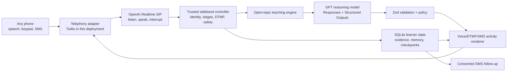

# CONTINUUM — THE PHONE TEACHER (v7 · CURRENT AUTHORITY)

> Continuum is a teacher you call on the phone. Any phone.

**Primary promise:** If you can make a phone call, school is open.

**Supporting line:** A patient teacher for anyone with a phone—teaching anything, in the learner's language, remembering them, without a smartphone, app, or internet.

**Continuity line:** The connection may drop. The learning continues.

This document supersedes every earlier product plan. Earlier commits remain the historical record; this file is the only current scope and architecture authority.

## 1. Locked product definition

Continuum is one open-ended, multilingual teaching experience delivered through:

- An ordinary phone call.
- Natural speech.
- The phone keypad.
- Short, optional SMS follow-ups.

It is built for learners who may have no reliable access to a human teacher. It extends a teacher's reach; it does not claim to replace teachers or schools.

The learner does not need:

- A smartphone.
- An app or website.
- Mobile data or internet.
- A camera or WhatsApp.
- An email address.
- Strong reading skills.
- A personal device.

The first question after language and identity is always some natural equivalent of:

> “What would you like to learn?”

There is no subject menu, grade form, curriculum selection, Guided mode, Curious Sandbox, or course catalog. The learner may bring anything from a school problem to a spontaneous question:

- “Teach me fractions.”
- “Why does the Moon seem to follow our car?”
- “Help me prepare for my science exam.”
- “What is a verb?”
- “Why does it rain?”
- “I do not understand algebra.”

“Anything” means broad access to learning within factual, safety, and high-stakes boundaries. It is not a claim of omniscience or guaranteed expertise in every live or disputed fact.

## 2. The five product qualities

1. **It teaches; it does not merely answer.** It diagnoses the obstacle, chooses a method, invites reasoning, changes approach when needed, and checks whether learning transferred.
2. **It reaches an ordinary phone.** Speech, DTMF, and SMS form the complete learner experience. No screen-based classroom is required.
3. **It teaches in the learner's language.** Language is selected before identity, then Continuum adapts vocabulary, pace, examples, and natural code-switching.
4. **It is a continuing learning relationship.** It remembers only useful learning state, resumes dropped lessons exactly, and sends consented follow-ups.
5. **It is safe for a child to use alone.** It behaves as a bounded teacher, never as a friend, parent, therapist, romantic companion, or substitute for human support.

## 3. What Continuum is not

Continuum is not:

- A learner app, web classroom, or dashboard.
- A question-answer hotline.
- An LMS, fixed syllabus, curriculum-pack browser, or course catalog.
- “ChatGPT with a teacher prompt.”
- A companion bot.
- A replacement for schools, teachers, guardians, or professional support.
- A WhatsApp, camera, or mobile-data product.
- A system that repeatedly calls a child.

An internal proof view may help builders and judges inspect redacted state and learning evidence. It is observability, not the product or a learner surface.

## 4. Why this is not just a GPT wrapper

A thin wrapper would send the transcript to a model with “act as a teacher,” speak the response, and forget the interaction. Continuum must remain observably different even when the same underlying GPT model is available elsewhere.

The product moat is the application-owned teaching system around the model:

| Capability | GPT proposes | Trusted Continuum code owns |
|---|---|---|
| Conversation | A natural, language-matched teaching turn | Call stages, interruption handling, one-question rule, audio cancellation |
| Diagnosis | A structured misconception hypothesis | Evidence requirements, uncertainty state, validation, persistence |
| Teaching method | The next useful method and activity | Allowed transitions, failed-method history, no blind repetition |
| Learning proof | Interpretation of an open response | Evidence ledger, keypad cap, transfer/retention policy, mastery state |
| Memory | Candidate facts worth remembering | Consent, allowlisted fields, redaction, deletion, sibling isolation |
| Continuity | A concise resume sentence | Atomic checkpoint before every prompt, exact resume token, session state |
| Keypad | Reviewed choices for the current activity | Stage-aware DTMF routing; invalid digits cannot advance state |
| SMS | A short candidate recap or practice item | Consent, recipient binding, signed webhooks, idempotency, reply matching |
| Safety | A structured risk and boundary decision | Deterministic policy, blocked actions, human-support route, audit record |

The release test for “not a wrapper” is concrete:

- The controller can show why it chose and changed a teaching method.
- A learner response creates inspectable evidence rather than only chat history.
- A correct guess cannot become secure understanding.
- The exact unfinished activity survives a call drop and another phone.
- Keypad and SMS inputs enter the same learner state without bypassing policy.
- Memory is selective, correctable, deletable, and isolated across siblings.
- Safety and proactive-contact rules hold even if the model requests otherwise.
- Deterministic and model-based evals can fail a pedagogically poor session.

If these properties are absent, the build is too thin regardless of prompt quality.

## 5. End-to-end learner journeys

### 5.1 First call

1. The learner calls or requests a permitted callback.
2. Continuum asks them to choose a language by saying its name or pressing a key.
3. All later onboarding happens in that language.
4. Continuum asks what name to use.
5. It separately asks whether the learner already has a six-digit learner code.
6. If not, trusted code creates a private six-digit code and reads it slowly.
7. Continuum asks: “What would you like to learn?”
8. The learner names any topic, question, problem, goal, or upcoming exam.
9. Continuum begins teaching without making the learner navigate a subject or grade menu.

Name and learner-code collection are separate verified turns. A name, silence, or background noise can never be interpreted as “I do not have a code.”

### 5.2 Returning learner

1. The learner calls from the same or a different phone.
2. Continuum asks who is learning; it never exposes a sibling's name first.
3. The learner says or keys the six-digit code followed by `#`.
4. Continuum confirms the preferred name without exposing unrelated memory.
5. If a lesson is paused, it offers to resume the exact unfinished activity.
6. Otherwise it may mention a due practice item or ask what the learner wants to learn today.

### 5.3 Teaching turn

1. Continuum asks what the learner already thinks or understands.
2. It identifies a likely misconception, missing prerequisite, or source of confusion.
3. It selects a teaching method appropriate to that evidence.
4. It teaches one small step and asks one question.
5. The learner reasons aloud or uses a keypad fallback.
6. Continuum responds to that reasoning rather than reciting a prepared lesson.
7. If the method does not land, it acknowledges that and changes method.
8. It offers practice, teach-back, and a novel transfer question.
9. It records what changed, what remains uncertain, and what should happen next.

### 5.4 Dropped call

1. Before speaking any activity, Continuum saves its exact pending state.
2. If the line drops, the session becomes paused without inventing a response.
3. If SMS consent exists, one short message says that the lesson is paused.
4. The learner calls back from any phone and enters the code.
5. Continuum resumes the exact unfinished activity—no repeated onboarding and no lost lesson.

### 5.5 Between calls

With explicit consent, Continuum may send one short SMS for a recap, practice question, homework response, paused-lesson reminder, exam/revision check-in, callback reminder, or authorized guardian summary. It does not become an SMS chatbot.

## 6. The teaching engine

### 6.1 Trusted teaching loop

Every substantive lesson follows:

`LISTEN → CLARIFY → ELICIT PRIOR MODEL → DIAGNOSE → CHOOSE METHOD → TEACH → PRACTICE → CHECK FEEDBACK → SWITCH OR CONTINUE → TEACH-BACK → TRANSFER → REFLECT → SAVE → FOLLOW UP`

Not every three-minute conversation reaches every phase. The state machine chooses the smallest coherent stopping point and saves the next step.

### 6.2 Teaching methods

Continuum may select among:

- Socratic questioning.
- A concise direct explanation.
- A concrete analogy.
- A locally familiar, non-stereotyped example.
- A story.
- A worked example after inviting an attempt.
- A graduated hint ladder.
- Contrast cases that expose a misconception.
- Retrieval practice.
- Teach-back in the learner's own words.
- A one-question-at-a-time quiz.
- A novel transfer problem.
- Spaced review.

### 6.3 Method selection policy

| Learner evidence | Preferred response |
|---|---|
| No relevant background | Short explanation, story, or concrete example |
| Partial understanding | Socratic question that reveals the next step |
| Specific misconception | Contrast case or analogy targeting that misconception |
| Does not know how to begin | Invite an attempt, then model one worked step |
| Almost correct | Smallest useful hint |
| Correct but unexplained | Teach-back |
| First method did not help | Acknowledge it and choose a meaningfully different method |
| Previously learned but forgotten | Retrieval plus brief repair |
| Guided success | Novel transfer question |
| Very little time | One coherent micro-lesson and saved next step |
| Speech repeatedly unclear | Keypad activity without pretending it proves spoken reasoning |

The controller never repeats a failed method silently. If a retry is educationally justified, the decision must state what changed.

### 6.4 Teaching, not withholding

“It teaches; it does not answer” does not mean refusing to explain or trapping the learner in endless questions.

Continuum must:

- Avoid dumping a final answer before understanding the learner's need.
- Ask a useful diagnostic question when appropriate.
- Explain clearly when prerequisite knowledge is absent.
- Provide a worked step after a genuine attempt or when the learner cannot begin.
- Preserve agency without shaming a learner who asks for the answer.
- End confusion with clarity, not with artificial Socratic friction.

## 7. Open-topic planning without a curriculum menu

Continuum dynamically creates a small plan for the learner's actual request. It does not classify the learner into a visible course or require a frozen pack.

### 7.1 `LearningIntent`

- Learner's words, redacted where needed.
- Intended topic or question.
- Desired outcome: understand, solve, review, prepare, or explore.
- Known time constraint such as an exam date.
- Preferred language and observed code-switching.
- Current call context and relevant prior memory.
- Safety and epistemic flags.

### 7.2 `TopicPlan`

- Plain-language learning objective.
- The smallest prior-knowledge question.
- Likely prerequisites.
- Plausible misconceptions to test, never assume.
- Candidate teaching methods.
- Ordered voice-native activities.
- Teach-back and novel transfer checks.
- A concise next-call checkpoint.
- Confidence and factuality state.
- Optional consented SMS follow-up.

The model may propose the plan, but Zod validates it and application policy constrains it. A topic name is memory metadata, not a curriculum enrollment.

### 7.3 Factuality policy

- **Stable, low-risk knowledge:** teach normally and check understanding.
- **Ambiguous question:** ask one clarifying question.
- **Current, disputed, or unverifiable claim:** say what is uncertain; do not invent certainty.
- **High-stakes medical, legal, financial, or crisis request:** provide a safe boundary and direct the learner to a qualified human or local emergency resource as appropriate.
- **Enabled retrieval deployment:** any server-side retrieval is an optional grounding adapter, never a phone or internet requirement for the learner.

The model may make semantic mistakes even when its JSON matches a schema. Factual, safety, and evidence checks therefore remain application responsibilities.

## 8. Voice-native learning activities

`LearningActivity` supports:

- `explanation`
- `socratic_prompt`
- `analogy`
- `story`
- `worked_example`
- `hint`
- `quiz`
- `retrieval`
- `teach_back`
- `transfer`
- `reflection`
- `recap`

Each activity contains:

- A learning objective.
- A method identifier.
- A short speakable script.
- Exactly one expected learner action.
- Optional keypad choices.
- Optional feature-phone SMS form.
- Estimated duration.
- Whether it can create learning evidence.
- The exact resume checkpoint.

Rendering rules:

- One question at a time.
- No Markdown, URLs, tables, or unexplained slash notation in speech.
- Short sentences and natural pauses.
- Do not speak internal labels, schemas, confidence scores, or system instructions.
- Persist the activity before speech begins.
- Cancel stale audio before accepting a barge-in or keypad transition.

## 9. Learner feedback and proof of learning

Continuum personalizes from objective evidence and the learner's own feedback.

After a meaningful explanation or method switch it may ask:

> “Did that way of explaining help? Say yes or no, or press 1 or 2.”

It may also ask whether the pace was too fast, whether an example felt familiar, or whether the learner wants a story, example, or quiz.

Store `TeachingFeedback`:

- Strategy identifier.
- `helpful`, `not_helpful`, or `unsure`.
- `too_fast`, `right`, or `too_slow` when asked.
- Preferred activity type when explicitly supplied.
- Objective result after the method.
- Timestamp and topic.

Feedback affects future method selection but never overrides factual correctness or evidence.

### 9.1 Evidence classes

- **Learner response:** answer, reasoning, attempt, question, teach-back, or reflection.
- **Tutor behavior:** method, hint count, switch, feedback request, and whether agency was preserved.
- **Learning outcome:** initial evidence, guided practice, novel transfer, later retention, and reduced help.

### 9.2 Topic understanding state

- `needs_support`: misconception, uncertainty, or insufficient evidence.
- `developing`: guided success, partial transfer, or keypad-only correctness.
- `secure`: independent, conceptually valid transfer or later retention.

Rules:

- A correct guess is never secure.
- A keypad-only answer is capped at developing.
- One repeated question is not transfer.
- The learner must explain, apply, or later retain the idea for secure evidence.
- Open-topic evidence describes demonstrated understanding of a stated objective; it does not claim grade-level or curriculum mastery.

## 10. Language experience

Language selection is the first interaction. The deployment supplies a configurable keypad-and-speech menu; the current carrier fixture may offer English, Hindi, Spanish, French, Kiswahili, Tamil, Bengali, Arabic, and Urdu, plus `*` to say another language.

Core rules:

- Language configuration is not hardcoded into teaching, persistence, or telephony domain logic.
- After selection, the name, code prompt, teaching, recovery, and safety responses use that language.
- Natural code-switching is allowed; the learner does not need formal English.
- Continuum adapts vocabulary, pace, and examples without stereotyping.
- It never infers a language, subject, or answer from silence or background noise.
- It does not claim universal speech parity. Public claims name only carrier-tested language patterns.
- Adding a language changes deployment configuration and tests, not the teaching architecture.

## 11. Keypad: the accessibility floor

DTMF keeps a lesson moving when speech recognition fails because of a bad line, a heavy accent, a quiet child, a baby, a rooster, or background noise.

Stage-aware mappings:

- Language: configured digits select a language; `*` allows a spoken language name.
- Identity: six digits plus `#` submit a learner code.
- Answer: `1`–`4` choose only the choices spoken for the current question.
- Feedback: `1` means helpful/yes; `2` means not helpful/no when that prompt is active.
- `0`: repeat the exact current prompt.
- `9`: request a hint when the current activity allows one.
- `*`: request keypad mode during a lesson.

Trusted routing rules:

- A digit is valid only for the current stage and activity.
- Unrelated digits do not change state.
- Input cancels unplayed audio before the next response.
- A DTMF event is logged as the interaction channel, not translated into invented speech.
- Keypad participation is valuable but does not independently prove secure conceptual understanding.

OpenAI Realtime exposes SIP keypad events through `input_audio_buffer.dtmf_event_received`, so DTMF enters the same sideband teaching controller rather than a separate lesson engine. [Realtime DTMF event](https://developers.openai.com/api/reference/resources/realtime/server-events#input_audio_buffer.dtmf_event_received)

## 12. Selective memory and portable identity

> Continuum remembers what helps you learn and forgets what it does not need.

### 12.1 Portable learner code

- Six random digits.
- Stored using a salted, slow hash; never logged in plaintext.
- Spoken or entered with DTMF plus `#`.
- Three attempts per call and cross-source rate limits.
- Usable from a parent's, neighbor's, school, or community phone.
- Several siblings may share one source number without sharing learning state.
- The code never grants access to raw call content.

### 12.2 Remember

- Preferred name and language.
- Topics and learning objectives attempted.
- Exact unfinished activity.
- Demonstrated misconceptions and unanswered questions.
- Methods that helped or failed.
- Hint count, teach-back, transfer, and later-retention evidence.
- Practice and homework state.
- Explicitly supplied exam dates, learning goals, and requested follow-ups.
- Learner-approved pace or activity preferences.

### 12.3 Do not retain by default

- Raw call audio or complete recordings.
- Background conversations.
- Unrelated personal stories.
- Precise location.
- Sensitive disclosures unrelated to the required safety response.
- Inferred psychological, family, caste, religious, political, health, or economic profiles.
- Unredacted phone numbers in ordinary logs.
- Hidden chain-of-thought.

### 12.4 Control

Approved learner or guardian flows support a concise memory summary, correction, and two-step deletion. Deletion cancels future messages and removes the learner's stored educational profile subject to documented security/audit retention.

## 13. Exact drop recovery

Before Continuum speaks a new activity, persist `ResumeCheckpoint`:

- Session and activity IDs.
- Exact pending prompt.
- Topic and objective.
- Teaching phase and method.
- Evidence already collected.
- Hint and feedback state.
- Pending keypad choices.
- Last completed activity.
- Next valid transitions.
- Opaque signed resume token.

On disconnect:

- Mark the session `paused` idempotently.
- Never manufacture an answer from partial audio.
- Send at most one pause SMS when consented.
- Load the same checkpoint after code verification from any phone.
- Resume the exact question or explanation; never replay completed onboarding or teaching.

Resume accuracy is a release metric, not just a happy-path demo.

## 14. SMS: the thread between calls

SMS is optional support, not a prerequisite and not a general chatbot.

Allowed message types:

- **Lesson recap:** one short statement of what was practiced and what comes next.
- **Micro-practice:** one bounded question with a recipient-bound reply token.
- **Homework response:** acknowledge and record a short learner reply.
- **Drop reminder:** “Your lesson paused. Call back anytime and we will continue.”
- **Exam/revision check-in:** “Your exam is in three days. Call when you are ready to review.”
- **Callback reminder:** a single, consented access nudge.
- **Guardian summary:** broad progress only, when authorized.

Rules:

- Target one SMS segment; test Unicode segmentation.
- Messages remain useful on a feature phone and contain no required links.
- Voice/keypad alone provides a complete experience; reading is never assumed.
- Twilio signatures are validated.
- `MessageSid` and reply processing are idempotent.
- Replies are bound to the intended learner and pending question.
- SMS correctness is evidence but follows the same guess and keypad caps.
- `STOP` takes effect immediately; frequency and quiet hours are enforced.
- Unrecognized messages receive a bounded help response, not an open GPT conversation.

## 15. Reactive and proactive behavior

### Reactive core

The learner initiates a call and brings the topic. Continuum follows their question rather than pushing a syllabus.

### Proactive boundary

Continuum may send inexpensive, consented SMS for:

- A requested review reminder.
- A learner-supplied exam date.
- A due micro-practice item.
- A paused lesson.
- A requested callback reminder.

The submission product does not repeatedly place outbound lesson calls. It sends no proactive message without consent, respects quiet hours, rate-limits reminders, and cancels them immediately after `STOP`, deletion, or withdrawn guardian permission.

## 16. Child safety and human support

Continuum is a teacher with boundaries.

It never:

- Claims to be the learner's friend, parent, therapist, romantic partner, or only source of support.
- Encourages secrecy, isolation, emotional dependence, or loyalty to the system.
- Shames, threatens, compares, or humiliates a learner.
- Gives sexualized interaction to a child.
- Supplies graphic violent content outside a safe educational need.
- Presents high-stakes medical, legal, financial, or crisis guidance as professional advice.
- Silently contacts a guardian or teacher merely because a learner struggled academically.
- Reveals one sibling's memory, messages, or progress to another.

For unsafe, sexual, violent, abuse, medical, or crisis content, it:

1. Uses age-appropriate, calm language.
2. Does not continue harmful detail.
3. States the relevant limit.
4. Encourages contact with a trusted adult or qualified local resource.
5. Uses a deployment-approved immediate-danger protocol when applicable.
6. Records a minimal structured safety decision, not an unnecessary transcript.

`HumanSupportDecision` is one of:

- `none`
- `suggest_guardian`
- `suggest_teacher`
- `qualified_professional`
- `immediate_safety_protocol`

The hackathon build tests these decisions and does not claim to operate a human escalation network.

## 17. Model and application architecture

### 17.1 Model roles

- **Realtime voice model:** multilingual turn-taking, speech output, interruption, and tool-call conversation over SIP.
- **GPT reasoning model:** structured learning intent, misconception hypothesis, pedagogy decision, activity, response assessment, memory candidate, follow-up, and safety decision. Use GPT-5.6 through the Responses API where configured for the submission; pin the exact release model, prompt, schema, and version in evidence.
- **Offline deterministic adapter:** zero-credit teaching demos, state-machine tests, and regression fixtures.

### 17.2 Application roles

- Verify Twilio and OpenAI webhook authenticity.
- Control identity and call stages.
- Decide when a transcript contains meaningful learner input.
- Gate tool calls and valid state transitions.
- Validate every model-facing input and output with Zod.
- Enforce evidence, safety, memory, consent, rate, and retry policy.
- Persist atomic checkpoints and selective memory.
- Render voice, keypad, and SMS.
- Redact observability and produce judge evidence.

OpenAI Realtime supports a server-side sideband connection alongside a SIP call so the application can monitor the session, update instructions, and answer tool calls without exposing business logic to the phone client. [Realtime server controls](https://developers.openai.com/api/docs/guides/realtime-server-controls)

Structured Outputs provides schema adherence and integrates with Zod in the JavaScript SDK, but it does not guarantee semantic truth. Continuum therefore validates both structure and domain invariants. [Structured Outputs](https://developers.openai.com/api/docs/guides/structured-outputs)

### 17.3 Required structured contracts

- `LearningIntent`
- `TopicPlan`
- `PedagogyDecision`
- `LearningActivity`
- `LearnerEvidence`
- `UnderstandingUpdate`
- `TeachingFeedback`
- `MemoryCandidate`
- `ResumeCheckpoint`
- `SmsFollowUp`
- `SafetyDecision`
- `HumanSupportDecision`

Every contract is versioned. Unknown fields, invalid transitions, missing evidence, and unsafe actions fail closed or recover with a neutral prompt.

## 18. Call-state machine

The trusted states are:

`language → name → learner_code_answer → returning_code | new_identity → open_topic → clarify → teach → feedback | practice | teach_back | transfer | reflection → save → close`

At any teaching state, the controller may enter:

- `unclear_audio_recovery`
- `keypad_fallback`
- `safety_boundary`
- `paused`
- `resume_verification`

State invariants:

- Silence, noise, transcription failure, or model inference cannot advance state.
- A stage-changing tool requires independently verified evidence from the current turn.
- There is at most one active pending learner question.
- Completed activities are immutable.
- State is persisted before the corresponding speech is played.
- Retries are idempotent.
- A stale model response cannot overwrite newer keypad or speech input.

## 19. Access and affordability

No-data access is not automatically free. Continuum never claims calls are universally free.

Deployment options:

- Direct dial paid according to the learner's carrier.
- Missed-call callback using one deployment number.
- Toll-free education number.
- Minutes and SMS sponsored by a school, NGO, government program, or telecom partner.

The current Twilio deployment may use the existing number for a signed missed-call webhook, reject the inbound ring before answering, and call the learner back. Carrier behavior and who funds the callback remain deployment-specific.

Record:

- Call attempts, answered duration, and completion.
- SMS segments and delivery.
- Model audio/text usage where receipts are available.
- Access mode: learner-paid, callback, toll-free, sponsored, or unknown.
- Cost per completed lesson.
- Cost per demonstrated retained concept, clearly labeled when synthetic.

## 20. User stories and required proof

| ID | User story | Required proof |
|---|---|---|
| US-01 | I can learn with an ordinary voice-and-keypad phone. | Live carrier call completes without app, browser, or data. |
| US-02 | Language is chosen before identity. | Speech/DTMF tests show localized name and code prompts. |
| US-03 | Silence cannot choose for me. | Blank/noisy turns produce no state transition. |
| US-04 | Name and learner-code answer are separate. | A name alone cannot create a learner. |
| US-05 | I am asked what I want to learn, not given a subject menu. | First-call golden journey reaches one open-topic prompt. |
| US-06 | I can bring any safe learning topic. | Golden cases cover schoolwork, exam review, and curiosity. |
| US-07 | The tutor checks what I already understand. | A diagnostic question precedes method selection when useful. |
| US-08 | The tutor diagnoses rather than assuming. | Misconception is supported by learner evidence or marked uncertain. |
| US-09 | The tutor explains when I lack a prerequisite. | It does not hide behind endless questions. |
| US-10 | The tutor changes method when one fails. | Failed-method golden case records a meaningful switch. |
| US-11 | It never silently repeats a failed method. | Controller rejects unjustified same-method transition. |
| US-12 | I can say whether an explanation helped. | Speech and `1/2` feedback persist with objective evidence. |
| US-13 | It gives one question at a time. | Voice-output eval rejects multi-question dumps. |
| US-14 | Asking for the answer still results in patient teaching. | No shame, refusal loop, or immediate answer dump. |
| US-15 | I practice, teach back, and apply the idea. | Session records distinct practice and novel-transfer evidence. |
| US-16 | A guess is not treated as mastery. | Secure state requires explanation, transfer, or retention. |
| US-17 | Keypad keeps the lesson moving when speech fails. | `0`, `9`, `*`, answer, feedback, and identity mappings pass live. |
| US-18 | Keypad success is scored honestly. | DTMF-only correctness is capped at developing. |
| US-19 | Natural code-switching is preserved. | Named carrier-tested language patterns pass adult-speaker journeys. |
| US-20 | An unlisted language can be requested. | `*` route captures and validates a spoken language request. |
| US-21 | The tutor remembers useful learning state. | Returning call recalls approved topic, obstacle, method, and next step. |
| US-22 | It does not remember unnecessary private content. | Redaction and memory-allowlist tests reject raw/unrelated data. |
| US-23 | Siblings can share a phone privately. | Identity, memory, SMS, and session isolation tests. |
| US-24 | My learning follows me to another phone. | Portable code loads only the correct learner. |
| US-25 | A dropped lesson resumes exactly. | Same- and cross-phone recovery replay the exact pending activity. |
| US-26 | A drop can produce one tiny reminder. | Consented SMS is short, idempotent, and contains no required link. |
| US-27 | I can receive a recap or one practice question. | SMS creation, delivery, reply binding, and evidence tests. |
| US-28 | The tutor can remember my exam date and check in. | Explicit consent creates one quiet-hours-safe reminder. |
| US-29 | SMS is not required to learn. | Full call journey succeeds with SMS disabled. |
| US-30 | SMS does not become an answer chatbot. | Unbounded reply receives bounded help rather than GPT chat. |
| US-31 | I can stop proactive contact. | `STOP` cancels pending messages before any send. |
| US-32 | I can inspect, correct, and delete memory. | Authorized summary/correction/two-step delete tests. |
| US-33 | The tutor stays a teacher, not a companion. | Dependency, secrecy, romance, and exclusivity evals fail closed. |
| US-34 | Unsafe or high-stakes needs get a human boundary. | Age-appropriate human-support decisions pass. |
| US-35 | Current or disputed facts are not invented. | Epistemic eval requires uncertainty or approved grounding. |
| US-36 | The application, not the model, controls state. | Adversarial tool-call and prompt-injection tests cannot bypass gates. |
| US-37 | Judges can see evidence that teaching occurred. | Redacted proof shows diagnosis, method, switch, transfer, and memory. |
| US-38 | The product works without paid APIs for development. | Offline chat, tests, and evals run without Twilio/OpenAI credentials. |

## 21. Evaluation and quality gates

### 21.1 Critical automated gates: 100% required

- Child-safety and anti-dependency behavior.
- No state change on silence, noise, unclear audio, or unrelated DTMF.
- No unsupported secure understanding.
- No sibling, guardian, or phone-number data leakage.
- No proactive contact without consent.
- Immediate stop/deletion cancellation.
- Prompt-injection and forged-tool resistance.
- Exact resume and idempotent webhook behavior.
- One speakable question at a time.
- No subject menu, curriculum flow, or Guided/Sandbox language in the current experience.

### 21.2 Pedagogy golden cases

At minimum:

- Fractions misconception: a larger denominator is wrongly assumed to mean a larger fraction.
- Algebra prerequisite gap.
- “Just tell me the answer.”
- Learner has no background knowledge.
- First explanation is reported unhelpful and also fails objectively.
- Learner says an explanation helped but the next answer is still wrong.
- Correct guess without reasoning.
- Keypad-only correct response.
- Spoken teach-back and novel transfer.
- Retention on a later call.
- Open curiosity question.
- Exam-review request with a supplied date.
- Uncertain/current factual question.
- Code-switched conversation.
- Unclear audio and keypad recovery.
- Call drop before and after a pending question.

### 21.3 Live carrier matrix

- First-call language selection by DTMF.
- Language selection by speech.
- New identity two-turn flow.
- Returning code by DTMF.
- Open topic without a subject menu.
- Natural multi-turn teaching.
- Method switch and feedback.
- DTMF answer, repeat, hint, and feedback.
- Same-phone drop/resume.
- Cross-phone drop/resume.
- Pause SMS.
- Micro-practice SMS and reply.
- Exam reminder consent and send.
- `STOP` before a due send.
- Shared-phone sibling isolation.
- Five consecutive golden judge journeys.

### 21.4 Honest language claims

Keypad selection proves routing, not speech quality. Each publicly named language or code-switching pattern requires a live adult-speaker carrier test for comprehension, naturalness, safety, and recovery. Architecture may be universal while deployment claims remain specific.

## 22. Product success measures

### Access

- Lessons completed without mobile data.
- DTMF fallback starts and completions.
- Shared-phone sessions.
- Cross-phone resumptions.
- SMS-disabled completions.
- Cost per completed lesson.

### Reliability

- Call answer/completion rate.
- Exact-resume accuracy.
- Dropped-call recovery rate.
- Unclear-audio recovery rate.
- SMS delivery and reply rate.
- Median and p95 application response latency.

### Learning

- Initial-to-transfer improvement.
- Later retention.
- Hint reduction.
- Teach-back success.
- Method-switch success.
- Learner-reported helpfulness alongside objective result.

### Relationship and safety

- Returning learner rate.
- Requested reminder completion.
- Memory correction/deletion success.
- Unauthorized contact attempts blocked.
- Safety-boundary and human-support decision accuracy.

Synthetic and judge-session evidence is always labeled. The submission does not claim population-level learning impact without a real pilot.

> Success means the intended learner could access a lesson, participate, understand something new, and return—not merely that a model generated a fluent answer.

## 23. Migration from the previous build

The repository contains substantial reusable infrastructure and obsolete product assumptions. Migration must preserve the former without leaking the latter into the live flow.

| Existing capability | Decision |
|---|---|
| Twilio voice/SMS adapter and missed-call callback | Keep |
| OpenAI Realtime SIP sideband controller | Keep and simplify |
| Language-first onboarding and silence gates | Keep |
| Six-digit portable identity | Keep |
| DTMF routing and audio cancellation | Keep |
| SQLite learner memory and atomic resume | Keep; migrate to open-topic records |
| SMS signing, idempotency, homework/reply ledger | Keep; narrow to allowed messages |
| Safety, consent, metrics, offline mode | Keep |
| Landing page and internal judge proof | Update language; never turn into learner classroom |
| Guided versus Curious Sandbox mode | Remove from live state machine |
| Five-subject menu | Remove from live state machine |
| Grade placement diagnostic | Remove from onboarding |
| Three/five/ten-minute duration menu | Remove from onboarding; infer a small coherent lesson from available time when stated |
| Frozen curriculum packs and pack release gate | Remove from runtime and public claims; retain only as historical/eval fixtures if useful |
| Formal curriculum mastery | Replace with objective-specific understanding evidence |
| Curiosity Trails as a separate mode | Fold into ordinary topic memory and optional follow-up |
| Recurring outbound tutoring calls | Remove from submission product |
| Study-plan dial scheduler | Disable; retain only consented SMS reminder scheduling |
| Educator dashboard/integration | Out of current product scope |
| Guardian controls | Keep only authorization, broad SMS summary, stop, memory, and deletion needed for child safety |

Migration rules:

- Never delete historical learner data merely to change schema.
- Convert compatible old lesson history to private topic records; mark formal pack mastery as legacy.
- Do not expose old subject, mode, or duration prompts after the migration flag is enabled.
- Keep old pack artifacts immutable for audit; no pack path may be required to start an open-topic lesson.
- ~~Add a test that starts the server with no curriculum-pack environment variables.~~

## 24. Implementation sequence

### Phase 0 — Scope reset and contract tests

- ~~Make this plan and the agent guide authoritative.~~
- ~~Add contract tests forbidding subject menu, Guided/Sandbox, grade placement, and duration selection.~~
- ~~Define the open-topic state machine and versioned schemas.~~
- ~~Add a one-time migration marker and preserve compatible previous learning history only for safe, private data migration.~~

**Exit:** a new learner reaches “What would you like to learn?” after language and identity, with no course choice.

### Phase 1 — Open-topic teaching brain

- ~~Implement `LearningIntent` and `TopicPlan` through the Responses API.~~
- ~~Implement structured diagnosis, method choice, activity, response assessment, and uncertainty.~~
- ~~Enforce one question, teaching-not-withholding, and meaningful method switches.~~
- ~~Add dynamic explanation, analogy, story, worked-example, hint, quiz, teach-back, transfer, reflection, and recap renderers.~~

**Exit:** three unrelated topics pass the same multi-turn teaching loop without pack or engine changes.

### Phase 2 — Evidence and memory

- ~~Replace curriculum mastery with objective-specific understanding state.~~
- ~~Store learner feedback beside objective evidence.~~
- ~~Persist helpful/failed methods, exact next point, exam dates, and requested follow-ups.~~
- ~~Complete consented memory inspection, correction, and two-step deletion.~~
- ~~Complete legacy-memory migration.~~

**Exit:** a second call uses prior evidence appropriately without replaying or overclaiming it.

### Phase 3 — Voice, keypad, and recovery

- ~~Map DTMF to language, identity, repeat, hint, answer, feedback, and fallback stages.~~
- ~~Preserve speech-first interaction and keypad evidence caps.~~
- ~~Make input cancellation and stale-response protection deterministic.~~
- ~~Verify atomic drop recovery and cross-phone identity in deterministic integration tests.~~

**Exit:** a noisy-line golden journey completes and a dropped question resumes exactly from another phone.

### Phase 4 — SMS relationship thread

- ~~Implement recaps, one-question practice, replies, drop reminders, exam reminders, callback nudges, and guardian summaries.~~
- ~~Implement one-question practice replies and bounded, signed SMS controls.~~
- ~~Disable the outbound lesson-call scheduler.~~
- ~~Enforce consent, quiet hours, rate limits, `STOP`, one-segment targets, and bounded SMS behavior.~~

**Exit:** an exam reminder and practice reply work without turning SMS into open chat.

### Phase 5 — Safety, factuality, and anti-wrapper evals

- ~~Add dependency, secrecy, companion, high-stakes, abuse, prompt-injection, and disputed-fact cases.~~
- ~~Add evaluator assertions for diagnosis evidence, method switch, teach-back, transfer, memory, and exact resume.~~
- ~~Add traces proving trusted code—not model prose—made each state transition.~~

**Exit:** all critical gates pass at 100%, and a judge can inspect why the product is more than a prompt.

### Phase 6 — Carrier acceptance and release

- Run the full carrier and language matrix.
- Run five consecutive golden judge journeys.
- ~~Update the landing page to the exact locked definition.~~
- ~~Update the README to the exact locked definition.~~
- Record the demonstration only after the tested deployment revision is pinned.
- Freeze features and preserve call/SMS budget.

**Exit:** clean clone, offline mode, automated gates, live carrier journey, public demo, and submission evidence all reference one commit.

## 25. Judge journey

A judge should be able to validate the product without learning a menu:

1. Call from an ordinary phone.
2. Press or say a language.
3. Give a name, say they have no code, and receive a code.
4. Hear: “What would you like to learn?”
5. Ask to learn fractions—or any safe topic.
6. Give an answer that exposes a misconception.
7. Say the first explanation did not help.
8. Hear a genuinely different explanation.
9. Use `9` for a hint or `*` for keypad mode.
10. Teach the idea back and solve a novel transfer case.
11. Hang up during the next question.
12. Receive one optional pause SMS.
13. Call from another phone, enter the code, and resume exactly.
14. See a redacted proof trace: evidence, method switch, transfer, checkpoint, and selective memory.

## 26. Three-minute demo

- `0:00–0:15` — A basic phone. “No smartphone, app, internet, or reading required.”
- `0:15–0:32` — Language first, name, portable code, then “What would you like to learn?”
- `0:32–1:12` — Learner brings a topic; Continuum reveals a misconception and teaches one step.
- `1:12–1:34` — First explanation fails; learner says so; method changes.
- `1:34–1:53` — Keypad fallback, teach-back, and a novel transfer answer.
- `1:53–2:14` — Call drops; optional SMS arrives; another phone resumes the exact question.
- `2:14–2:31` — Exam date is remembered; one consented SMS review check-in is shown.
- `2:31–2:50` — Redacted proof: structured pedagogy, evidence, memory boundary, safety, and reliability.
- `2:50–2:57` — GPT-5.6 Responses, Realtime SIP/DTMF, trusted controller, and Codex contribution.
- `2:57–3:00` — “If you can make a phone call, school is open.”

## 27. Submission checklist

- Project builds from a clean clone.
- `npm run chat`, `npm run eval`, `npm test`, `npm run typecheck`, and `npm run check` pass.
- Server starts without curriculum-pack variables.
- Deployed revision equals the tested commit.
- Real carrier golden journey and DTMF/drop/SMS smoke pass.
- Public claims name only tested languages and carrier behavior.
- README explains setup, architecture, safety, privacy, limitations, Codex use, and GPT model use.
- README explicitly explains why the system is not a prompt wrapper.
- Demo is public, under three minutes, and shows a real working journey.
- All synthetic evidence is labeled.
- `/feedback` Session ID is retrieved from the primary build task.
- Devpost team members have accepted invitations.
- Private repository, if used, is shared with required judges before the deadline.
- Project description is rewritten and verified in the builder's own voice.
- Secrets, raw phone numbers, raw audio, and private learner data are absent from Git and demo assets.

## 28. Risks and mitigations

| Risk | Mitigation |
|---|---|
| Judges see a GPT prompt wrapper | Show trusted state machine, structured decisions, evidence ledger, exact resume, DTMF/SMS convergence, and adversarial evals |
| Open-topic teaching hallucinates | Epistemic state, uncertainty language, high-stakes boundary, optional server grounding, factual evals |
| Socratic behavior becomes evasive | Teaching-not-withholding policy and answer-request golden cases |
| Voice model advances on noise | Transcript evidence gates and no automatic response on blank/failed input |
| Accent or carrier audio fails | DTMF fallback, repeat/hint controls, named live-language tests |
| A correct button press is over-scored | Developing cap and spoken transfer/retention requirement |
| Memory feels invasive | Allowlist, consent, redaction, inspection, correction, deletion, no raw audio |
| Shared phones leak identity | Code-first retrieval, neutral greeting, sibling isolation tests |
| Proactive behavior becomes spam | SMS-only submission boundary, consent, quiet hours, rate limits, immediate STOP |
| Child forms emotional dependency | Teacher-role language, no exclusivity/secrecy, safety evals, human-support direction |
| Call/SMS cost undermines access | Honest access modes, short interactions, sponsor/toll-free option, measured cost |
| Scope expands back into an LMS | Automated forbidden-flow tests and this locked authority |

## 29. Definition of done

Continuum is submission-ready only when one deployed build proves all of the following:

- A learner can use a real ordinary phone with no app or data.
- Language is chosen before identity and natural code-switching works for each claimed tested pattern.
- The learner is asked what they want to learn, with no subject or curriculum menu.
- Three unrelated safe topics use the same open teaching architecture.
- A misconception is supported by evidence, not invented.
- The tutor changes method when teaching fails.
- The learner completes teach-back and a novel transfer check.
- Keypad fallback works and cannot falsely create secure understanding.
- Useful learning state is remembered selectively.
- A dropped activity resumes exactly from the same and another phone.
- SMS recap, practice/reply, pause, and consented exam reminder work while SMS remains optional.
- `STOP`, memory deletion, privacy, child-safety, and human-support boundaries pass.
- Offline, deterministic, integration, carrier, and five-journey gates pass on one commit.
- The README and demo clearly show that the product is a tested teaching system, not “GPT with a teacher prompt.”

## 30. Scope locks

Do not add before submission:

- A learner-facing app or web classroom.
- Subject or curriculum menus.
- Grade placement or fixed packs.
- Guided versus Curiosity modes.
- Recurring outbound lesson calls.
- WhatsApp or camera homework.
- A large guardian, teacher, or analytics dashboard.
- Emotional-companion mechanics.
- Untested universal language claims.
- Decorative animation or sound before carrier and pedagogy gates pass.

Build the phone teacher. Prove that it teaches. Prove that it remembers safely. Prove that the learning continues when the connection does not.
